This material is a companion to the lecture on Exploratory Data Analysis & Experimental Design for [STAT 540](https://stat540-ubc.github.io/). It demonstrates a number of data visualization/plotting methods along with some approaches to exploring a genomics data set. It was originally created by Paul Pavlidis, and modified by Keegan Korthauer. 

Often there is more than one way to do the same thing, so not everything here is shown in the lecture.

# Preliminaries

To run the code, you'll need these packages (install them first if they aren't already installed):


```r
knitr::opts_chunk$set(echo = TRUE)
library(tidyverse)
library(plyr)
library(readxl)
library(gridExtra)
library(ComplexHeatmap) 
library(GGally)
library(SummarizedExperiment)
library(pheatmap)
```

We'll also load a particular color palette for heatmaps, and set some preferred default ggplot theme elements.


```r
# Set up color scheme for heatmaps 
bcols<-colorRampPalette(c("#000000" ,"#800000" ,"#FF8000" ,"#FFFF00", "#FFFFFF"))(20)

# Set some defaults for ggplot2.
theme_set(theme_bw())
theme_update(panel.grid.major = element_blank(), panel.grid.minor = element_blank())
```

# Load data

Many of the examples here will use data from [Gompers et al., 2017](https://www.ncbi.nlm.nih.gov/pubmed/28671691). In this experiment, RNA-seq was performed on tissue from mice from two different genotypes, 5 developmental stages, and both sexes. The primary interest was the effect of genotype ("Group"), in which normal (wild-type) mice were compared to mice engineered to have one defective (mutant) copy of a particular gene (Chd8). According to paper there is supposed to be a total of 26 mutant and 18 WT samples. The paper also refers to 11,936 genes "robustly expressed".


First, let's obtain the data from GEO. The record for this study is at [Accession GSE99331](https://www.ncbi.nlm.nih.gov/geo/query/acc.cgi?acc=GSE99331). We would like the log(RPKM) matrix file listed in the Supplementary file list. The file name is `GSE99331_Gompers_logRPKM_Matrix.txt.gz`, which indicates it contains log-transformed RPKM Ideally, we'd have raw counts, but these were not made publicly available. However, Paul was obtain them directly from the authors - these are used in the RNA-seq examples Rmd. 

We'll download and read in this file using the URL obtained from the GEO record.


```r
# url to target file
rpkm.url <- "https://www.ncbi.nlm.nih.gov/geo/download/?acc=GSE99331&format=file&file=GSE99331%5FGompers%5FlogRPKM%5FMatrix%2Etxt%2Egz"

# download to a temporary file location 
rpkm.file <- tempfile()
download.file(rpkm.url, destfile = rpkm.file)

# read into R
d <- read.table(gzfile(rpkm.file), header=T, row.names=1)
```

We'll reformat the sample names to a cleaner presentation, and to exactly match the ones in the metadata file we'll deal with next.


```r
# as is
head(names(d))
```

```
## [1] "X12.5.2.2.1.Sample_ANAN001A" "X12.5.1.1.2.Sample_ANAN001B"
## [3] "X12.5.1.1.3.Sample_ANAN001C" "X12.5.2.2.4.Sample_ANAN001D"
## [5] "X12.5.2.2.5.Sample_ANAN001E" "X12.5.1.2.6.Sample_ANAN001F"
```

```r
# Drop the prefixes on the sample names since they aren't used. These have the format X12.5.2.2.1.{part we want that also contains '.'} - partly due to R mangling.
names(d)<-sub("^X[0-9]+\\.([0-9]+\\.)+", names(d), replacement="")

# reformated
head(names(d))
```

```
## [1] "Sample_ANAN001A" "Sample_ANAN001B" "Sample_ANAN001C" "Sample_ANAN001D"
## [5] "Sample_ANAN001E" "Sample_ANAN001F"
```

The supplement of the paper provides a file - Table S2 [nn.4592-S4.xls](https://www.nature.com/articles/nn.4592) that has the sample information ('metadata'). This is an Excel file; be aware that Excel is [famous for mangling data](https://www.google.com/url?sa=t&rct=j&q=&esrc=s&source=web&cd=&cad=rja&uact=8&ved=2ahUKEwi03em71J7uAhWqIDQIHUlDDZgQFjABegQIChAC&url=https%3A%2F%2Fgenomebiology.biomedcentral.com%2Farticles%2F10.1186%2Fs13059-016-1044-7&usg=AOvVaw1VBeg-83y_-NNBFsMrlm0r), like turning gene names into dates! We'll read it directly into R. Also we'll rename and recode some variables as factors. For now we'll keep DPC (developmental time) as numeric and just use `factor(m$DPC)` when we want to consider it a factor.


```r
# url to target file
meta.url <- "https://static-content.springer.com/esm/art%3A10.1038%2Fnn.4592/MediaObjects/41593_2017_BFnn4592_MOESM4_ESM.xlsx"

# download to a temporary file location 
meta.file <- tempfile()
download.file(meta.url, destfile = meta.file)

# read into R
m <- read_xlsx(meta.file)

# Do some renaming and recoding
names(m)<-c("Number", "Sample", "DPC", "Sex", "Group", 
            "SeqRun", "MappedReads", "FeatureCounts")
m$Sex<-factor(m$Sex)
m$Group<-factor(m$Group)
m$Sex=recode(m$Sex, `1`="M", `2`="F")
m$Group=recode(m$Group, `1`="WT", `2`="Mutant")
m$SeqRun=factor(m$SeqRun)
```

# Organizing the data

Next, we'll ombine the metadata and data into a single structure, tidyverse style to play nice with ggplot2. Before combining, it is **very important** to make sure that the samples are in the same order in the RPKM matrix and metadata table.


```r
# check our two dfs are in the same order (VERY IMPORTANT!)
identical(m$Sample, names(d))
```

```
## [1] TRUE
```

Now we're ready to combine into 'long' format - This is the "tidy way". It is ideal for visualization with packages like ggplot2. 


```r
# RPKMs in 'long' format - one
d_long <- d %>% 
  rownames_to_column("gene") %>%
  gather(key="Sample", value="Expression", -gene)

# join rpkms with meta data (already in long format)
d_long <- join(d_long, m, by="Sample")

dim(d_long)
```

```
## [1] 534952     10
```

```r
head(d_long)
```

```
##            gene          Sample Expression Number  DPC Sex  Group SeqRun
## 1 0610007P14Rik Sample_ANAN001A   5.238647      1 12.5   F Mutant      A
## 2 0610009B22Rik Sample_ANAN001A   4.251070      1 12.5   F Mutant      A
## 3 0610009O20Rik Sample_ANAN001A   4.807282      1 12.5   F Mutant      A
## 4 0610010F05Rik Sample_ANAN001A   4.830067      1 12.5   F Mutant      A
## 5 0610010K14Rik Sample_ANAN001A   5.958641      1 12.5   F Mutant      A
## 6 0610011F06Rik Sample_ANAN001A   4.619302      1 12.5   F Mutant      A
##   MappedReads FeatureCounts
## 1    42452222      37655856
## 2    42452222      37655856
## 3    42452222      37655856
## 4    42452222      37655856
## 5    42452222      37655856
## 6    42452222      37655856
```

Another great way to organize the data is to use an [`SummarizedExperiment`](https://bioconductor.org/packages/release/bioc/vignettes/SummarizedExperiment/inst/doc/SummarizedExperiment.html). This is the "Bioconductor way" of housing the data and metadata in one object, and has handy accessor functions that subset both types of information at once (e.g. subsetting by sample or gene).


`SummarizedExperiment` objects (and similar derived classes) are ideal for analyses like differential expression, as many Bioconductor packages use this object format as input and output. It is also more efficient for storage than the long format (since the long format duplicates information when it converts to one row per measurement), but it is less flexible for certain types of visualization, so requires either some manipulation or specialized functions. We'll come back to this format later, but here is how to construct a `SummarizedExperiment` object for now. 


```r
se <- SummarizedExperiment(assays = list(logrpkm=d),
                           colData = m)
# view summary info
se
```

```
## class: SummarizedExperiment 
## dim: 12158 44 
## metadata(0):
## assays(1): logrpkm
## rownames(12158): 0610007P14Rik 0610009B22Rik ... Zzef1 Zzz3
## rowData names(0):
## colnames(44): Sample_ANAN001A Sample_ANAN001B ... Chd8.adult.S29
##   Chd8.adult.S31
## colData names(8): Number Sample ... MappedReads FeatureCounts
```

```r
# access the rpkm and meta data with assays() and colData() functions
assays(se)$logrpkm[1:10,1:4]
```

```
##               Sample_ANAN001A Sample_ANAN001B Sample_ANAN001C Sample_ANAN001D
## 0610007P14Rik        5.238647        5.042397        5.364602        5.207641
## 0610009B22Rik        4.251070        4.568908        4.625527        4.568743
## 0610009O20Rik        4.807282        4.743503        4.921915        4.813903
## 0610010F05Rik        4.830067        5.063055        4.861288        4.957009
## 0610010K14Rik        5.958641        5.810707        5.851939        6.043380
## 0610011F06Rik        4.619302        4.579443        4.900748        4.802624
## 0610012G03Rik        4.034303        4.121061        4.262631        4.341274
## 0610030E20Rik        3.223435        3.386738        3.189999        3.087422
## 0610031J06Rik        4.378630        3.943230        4.268431        4.399819
## 0610037L13Rik        4.230031        4.118569        4.312070        4.331146
```

```r
head(assays(se)$logrpkm[,se$DPC==77.0])
```

```
##               Chd8.adult.S23 Chd8.adult.S24 Chd8.adult.S25 Chd8.adult.S28
## 0610007P14Rik       5.117776       5.105053       5.074071       5.274795
## 0610009B22Rik       3.736176       4.437970       4.150157       4.726862
## 0610009O20Rik       4.218049       4.409190       4.386743       4.494319
## 0610010F05Rik       4.391540       3.700743       3.745234       3.602500
## 0610010K14Rik       5.245851       4.827066       4.953091       4.971989
## 0610011F06Rik       4.562028       4.714897       4.696579       5.080126
##               Chd8.adult.S29 Chd8.adult.S31
## 0610007P14Rik       5.051701       5.000228
## 0610009B22Rik       4.046562       4.485514
## 0610009O20Rik       4.402777       4.321922
## 0610010F05Rik       3.715847       3.912299
## 0610010K14Rik       4.910206       4.861016
## 0610011F06Rik       4.787186       4.849831
```

```r
colData(se)$DPC
```

```
##  [1] 12.5 12.5 12.5 12.5 12.5 12.5 12.5 12.5 14.5 14.5 14.5 14.5 14.5 14.5 14.5
## [16] 14.5 14.5 17.5 17.5 17.5 17.5 17.5 17.5 17.5 17.5 17.5 17.5 21.0 21.0 21.0
## [31] 21.0 21.0 21.0 21.0 21.0 21.0 21.0 21.0 77.0 77.0 77.0 77.0 77.0 77.0
```

# Initial inspection 

Some very basic looks at the data. we'll use the `SummarizedExperiment` object format for these checks.


```r
dim(se)
```

```
## [1] 12158    44
```

```r
colnames(se)
```

```
##  [1] "Sample_ANAN001A"   "Sample_ANAN001B"   "Sample_ANAN001C"  
##  [4] "Sample_ANAN001D"   "Sample_ANAN001E"   "Sample_ANAN001F"  
##  [7] "Sample_ANAN001G"   "Sample_ANAN001H"   "Chd8.e14.S12"     
## [10] "Chd8.e14.S13"      "Chd8.e14.S14"      "Chd8.e14.S16"     
## [13] "Chd8.e14.S17"      "Chd8.e14.S18"      "Chd8.e14.S19"     
## [16] "Chd8.e14.S20"      "Chd8.e14.S21"      "Chd8.e17.5.1_S158"
## [19] "Chd8.e17.5.2_S159" "Chd8.e17.5.4_S161" "Chd8.e17.5.5_S162"
## [22] "Chd8.e17.5.6_S163" "Chd8.e17.5.1_S1"   "Chd8.e17.5.2_S2"  
## [25] "Chd8.e17.5.3_S3"   "Chd8.e17.5.4_S4"   "Chd8.e17.5.5_S5"  
## [28] "Chd8.P0.S1"        "Chd8.P0.S10"       "Chd8.P0.S11"      
## [31] "Chd8.P0.S2"        "Chd8.P0.S3"        "Chd8.P0.S4"       
## [34] "Chd8.P0.S5"        "Chd8.P0.S6"        "Chd8.P0.S7"       
## [37] "Chd8.P0.S8"        "Chd8.P0.S9"        "Chd8.adult.S23"   
## [40] "Chd8.adult.S24"    "Chd8.adult.S25"    "Chd8.adult.S28"   
## [43] "Chd8.adult.S29"    "Chd8.adult.S31"
```

```r
head(row.names(se))
```

```
## [1] "0610007P14Rik" "0610009B22Rik" "0610009O20Rik" "0610010F05Rik"
## [5] "0610010K14Rik" "0610011F06Rik"
```

```r
tail(row.names(se))
```

```
## [1] "Zxdb"   "Zxdc"   "Zyg11b" "Zyx"    "Zzef1"  "Zzz3"
```

```r
# check some random row names
row.names(se)[sample(nrow(se), 10)]
```

```
##  [1] "Hdgfrp2"       "Aptx"          "Cramp1l"       "Tspan11"      
##  [5] "Extl1"         "Enc1"          "Ppp2r2c"       "Ccdc166"      
##  [9] "2310033P09Rik" "Ppp1cc"
```

```r
# What's the range of values?
range(assays(se)$logrpkm)
```

```
## [1] -7.87235 13.26689
```

```r
# With the eset I would do range(exprs(deset))
# With the tibble I would use range(dmelt$Expression)

# any missing values?
any(is.na(assays(se)$logrpkm))
```

```
## [1] FALSE
```

This shows several things:

* The data look log-transformed as expected; presumably base is 2.
* There are 44 samples as expected
* The number of genes (rows) doesn't match any of the values mentioned in the paper (at least not obviously); it's not clear if this is all the data or filtered somehow.
* The rows are the gene symbols, and the rows seem to be in lexicographic order
* Names of samples are not very meaningful, but that's okay.
* No missing values (as usual, for RNA-seq data)

For the sample information we can look at the distributions of some of the features:


```r
# could also use e.g. m$Sex
table(se$Sex)
```

```
## 
##  M  F 
## 25 19
```

```r
table(se$Group)
```

```
## 
##     WT Mutant 
##     18     26
```

```r
table(se$DPC)
```

```
## 
## 12.5 14.5 17.5   21   77 
##    8    9   10   11    6
```

```r
table(se$SeqRun)
```

```
## 
##  A  B  C  D  E  H 
##  8  9  5  5 11  6
```

Let's dig a little deeper: compare these features to each other. 


```r
# examine the meta-data. 
# Omit the sample name/number
m %>% select(-Number, -Sample) %>%
  mutate(DPC=as.factor(DPC)) %>%
  ggpairs(aes(color=Group, alpha=0.4))
```

```
## `stat_bin()` using `bins = 30`. Pick better value with `binwidth`.
## `stat_bin()` using `bins = 30`. Pick better value with `binwidth`.
## `stat_bin()` using `bins = 30`. Pick better value with `binwidth`.
## `stat_bin()` using `bins = 30`. Pick better value with `binwidth`.
## `stat_bin()` using `bins = 30`. Pick better value with `binwidth`.
## `stat_bin()` using `bins = 30`. Pick better value with `binwidth`.
## `stat_bin()` using `bins = 30`. Pick better value with `binwidth`.
## `stat_bin()` using `bins = 30`. Pick better value with `binwidth`.
```

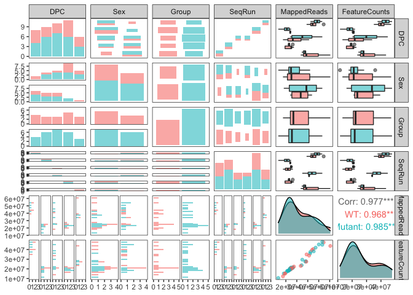<!-- -->

This is informative about the study design and reveals a few issues. 

* Mapped reads varies with the batches.
* Sex is not very well balanced with DPC. For example, all but one of the adults is male.
* There is a batch confound: Each stage (age) was run in separate batches (17.5 was split in two batches). This is confirmed by looking at the meta-data directly (RStudio `View(m)` and:


```r
# Looking closer at the Batch-Stage confound
table(m$SeqRun,m$DPC)
```

```
##    
##     12.5 14.5 17.5 21 77
##   A    8    0    0  0  0
##   B    0    9    0  0  0
##   C    0    0    5  0  0
##   D    0    0    5  0  0
##   E    0    0    0 11  0
##   H    0    0    0  0  6
```

The batch confound is the most concerning issue so far, but at least the Group is not confounded with batch. We'll come back to this.

We'll now move on to the main data.

## Simple plots of one row/col


```r
# Examples of simple plots of one column and one row. Used in previous lecture.
plot(d[,1], pch='.', ylab="Expression", xlab="Row")
```

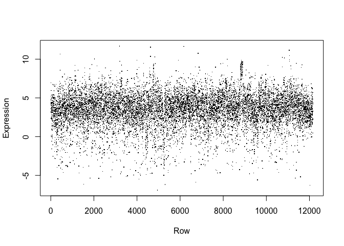<!-- -->

```r
plot(t(d[100,]), pch=20, ylab="Expression", xlab="Column")
```

<!-- -->

# Density plots 

Here, we'll examine box plots, smoothed density plots, and histograms. For each one, we'll show the base R graphics way, as well as the using the ggplot version using the tidy data (long) format.

## Box plots

First, we'll look at box plots per sample.

### Base R graphics


```r
boxplot(d, pch='.', xaxt='n', xlab="Sample", ylab="Expression")
```

<!-- -->

This give the impression that the data are already at least somewhat normalized, but not quantile normalized since they don't have the exact same distribution (quantile normalization is explained later in the course). I'm going to just leave it this way for now.

### ggplot


```r
# boxplot.To show sample names use element_text(angle = 90, hjust = 1) instead of element_blank()
ggplot(d_long, aes(Sample, Expression)) + 
  geom_boxplot() + 
  theme(axis.text.x = element_blank())
```

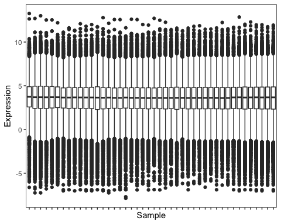<!-- -->

## Density plots

And next smoothed density plots (one grey line per sample, with the dark line representing the overall density of all samples).

### Base R graphics


```r
plot(0,xlim=c(-8,14), ylim=c(0,0.25), xlab="Expression level", type="n", ylab="Density", main="All samples and total")
apply(d, 2, function(x) { lines(density(x), col="grey") })
```

```
## NULL
```

```r
lines(density(as.matrix(d)), xlab="Expression level",  lwd=2)
```

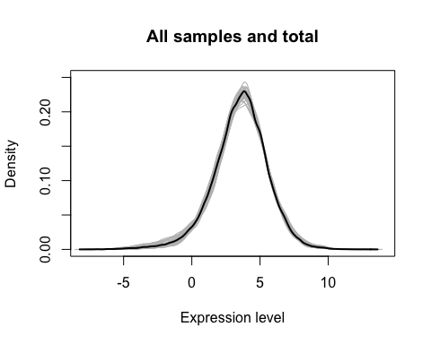<!-- -->

### ggplot


```r
# Overlaid plots
ggplot(data = d_long) + 
  geom_density(aes(Expression, group=Sample, group="Group"), color="grey") + 
  geom_density(aes(Expression), color="black", size=1.5)
```

```
## Warning: Duplicated aesthetics after name standardisation: group
```

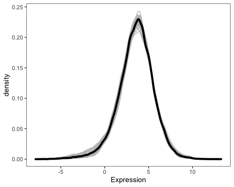<!-- -->

## Histograms

Finally, histograms. Here is a histogram for the first sample (all genes).

### Base R graphics


```r
hist(d[,1], breaks=50, xlab="Expression", 
     main=paste0("All genes in ", colnames(d)[1]))
```

<!-- -->

### ggplot


```r
#ggplot:
d_long %>% filter(Sample == d_long$Sample[1]) %>%
  ggplot(aes(Expression)) + 
    geom_histogram(binwidth = 0.4) + 
    ggtitle(paste0("All genes in ",  d_long$Sample[1]))
```

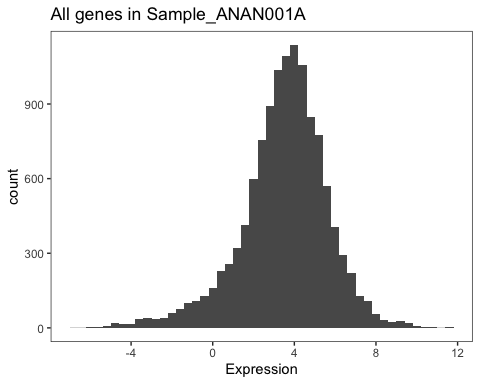<!-- -->

## Histograms vs density plots for bounded data

Density plots are not ideal for you have bounded data - especially if you care about what happens near the edges of the domain:


```r
set.seed(123)
bd <- data.frame(value = runif(1000))
p1 <- bd %>% 
  ggplot(aes(value)) +
    geom_histogram(binwidth = 0.05, boundary=0) 

p2 <- bd %>%
  ggplot(aes(value)) +
    geom_density() 

grid.arrange(p1, p2, nrow = 1)
```

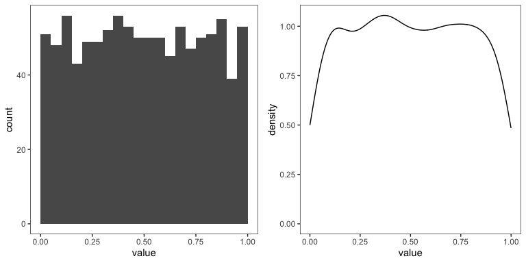<!-- -->

This will be relevant to topics such as inspecting distributions of p-values.

## Violin plots

A violin plot is similar to a boxplot, but instead of a box uses a symmetrical 'violin' shape that represents the smoothed density. We'll only show the ggplot version here since base graphics would require an add-on package.

### ggplot


```r
d_long %>%
  ggplot(aes(Sample, Expression)) + 
    geom_violin(aes(fill=Group)) + 
    theme(axis.text.x = element_blank())
```

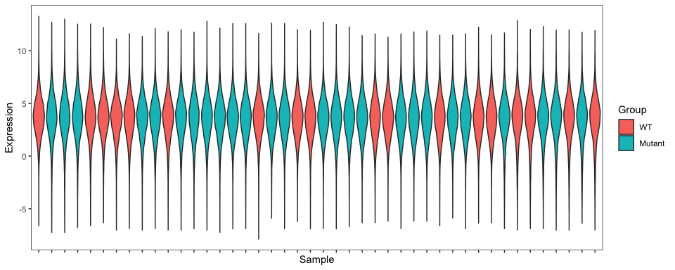<!-- -->


# Expression of Chd8

In the paper they say Chd8 was the top differentially-expressed gene. What does this look like? Again showing both base and ggplot2 way.

## base


```r
plot(t(d["Chd8",]), pch=20, ylab="Expression", xlab="Sample", main="Expression of Chd8")
```

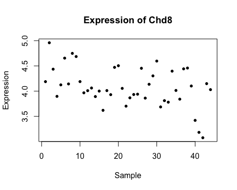<!-- -->

That's not stratified by anything so let's try a couple more things. Now we'll add DPC as a factor.


```r
plot(t(d["Chd8",]) ~ factor(m$DPC), ylab="Expression", xlab="DPC (as factor)", main="Expression of Chd8" )
```

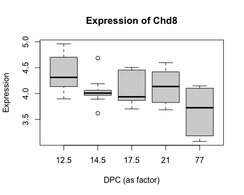<!-- -->

Note that the plot here switched to boxplot when we added a factor. Boxlots aren't good for small numbers of points, so specify type="p". 

```r
plot(t(d["Chd8",]) ~ m$DPC, type="p", pch=20, ylab="Expression", xlab="DPC (days)", main="Expression of Chd8", col=m$Group)
```

<!-- -->

Ideally, we'd add a legend, but this is tedious in base graphics. Let's switch to ggplot2 / tidy way.


## ggplot version

Note how I subset. Here we'll also change DPC to a factor instead of numeric so it's evenly spaced on the x axis.


```r
d_long %>% 
  filter(gene == "Chd8") %>%
  mutate(DPC = as.factor(DPC)) %>%
  ggplot(aes(DPC, Expression, color=Group)) + 
    geom_point( size=2 ) + 
    ggtitle("Expression of Chd8") 
```

<!-- -->

The effect of the mutation wouldn't be obvious at all if we didn't color by group. But this agrees with the paper (Figure 1d). It also looks like Chd8 expression drops with developmental stage (this was also noted in the paper), though we must keep in mind there is a confound with "SeqRun" (batch).

# Scatter plots

Let's make a scatter plot comparing expression of all genes in sample 1 vs sample 2. First pass: points are too big and ugly.


```r
plot(d[,1], d[,2], xlab="Sample 1", ylab="Sample 2", main="Using default glyphs")
```

<!-- -->

Better but still have *overplotting* - can't tell where points are overlapping just a little, or a lot:


```r
plot(d[,1], d[,2], pch='.', xlab="Sample 1", ylab="Sample 2", main="Using smaller glyphs")
```

<!-- -->

ggplot version, adding transparency with the `alpha` parameter. 


```r
ggplot(d, aes(Sample_ANAN001A, Sample_ANAN001G)) + geom_point( alpha=1 ) + ggtitle("alpha=1")
```

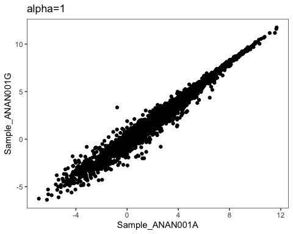<!-- -->

```r
ggplot(d, aes(Sample_ANAN001A, Sample_ANAN001G)) + geom_point( alpha=1/20) + ggtitle("alpha=1/20")
```

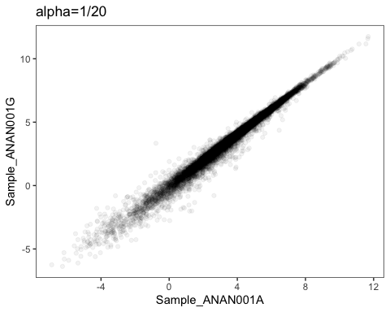<!-- -->
 
Another way to solve the overplotting problem is to use a two-dimensional density plot. A common way to do this is with `geom_hex`. Here the color indicates how many points are in each 2-D hex bin.


```r
ggplot(d, aes(Sample_ANAN001A, Sample_ANAN001G)) + geom_hex(bins=100)
```

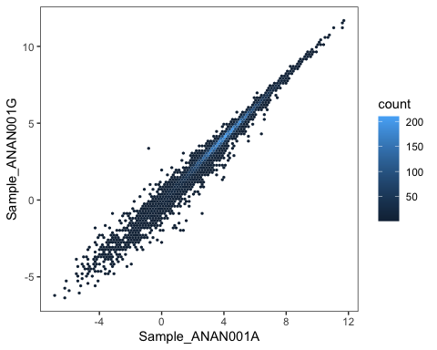<!-- -->

We can make many scatter plots at once (pairs plot). This is often useful but can get unwieldy - beyond about 10x10 it won't really work. First in base R:


```r
n <- 1000
pairs(d[sample(nrow(d), n),4:15], pch='.')
```

<!-- -->

Next in ggplot using `ggpairs` from the `GGally` package. Doesn't show the upper diagonal since these are repeat plots. Instead shows the correlation value (this is customizable).


```r
n <- 1000
ggpairs(d[,4:15], lower=list(continuous=wrap(ggally_points, size=0.5, alpha=0.1)))
```

<!-- -->

Those plots take some time to produce. A trick that's good to use sometimes - to speed things up: randomly subsample the data. Still get the big picture overall, but doesn't need to plot every single point.


```r
n<-2000
GGally::ggpairs(d[sample(nrow(d), n), 4:15], lower=list(continuous=wrap(ggally_points, size=0.5, alpha=0.1)), title=paste("Sampling",n,"points") )
```

<!-- -->

## Log transformation

It's worth a little digression to note that taking logarithms is often important in visualization (and analysis, for that matter). The data we're using is already log-transformed, so for this section I de-log (exponentiate) it for illustration.


```r
plot(2^d[,1], 2^d[,2], pch=20, cex=0.75, col="blue", xlab="Sample 1", ylab="Sample 2", main="de-logged data")
```

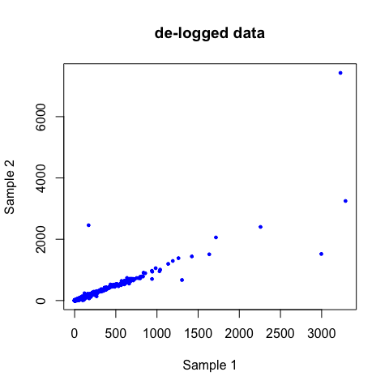<!-- -->

An even more striking illustration is what happens if we don't take logs when we look at the distribution.


```r
hist(apply(d, 1, function(x) 2^x),
     xlab="Expression (de-logged)", 
     main="Expression distribution of whole data set", breaks=50)
```

<!-- -->

Whenever you see a plot like this, you just know you can't leave it like that! You have to take logs (or some transformation) to alleviate the skewness and visualize the rest of the data.

Frequently when taking logs you will run into the problem of what to do with non-positive values (zeros, in particular). Just add a small constant. For data like this, a typical choice is adding 1 or 0.1. So instead of examining the distribution of log2(x), you'd look at log2(x+1).

# Heatmaps

A heatmap is a convenient way to display a large amount of data (e.g. many genes for several samples), making it easier to spot patterns of groupings/commonalities across the row and/or column variables. 

Here is a heatmap of just a little data - a random subset of 50 rows (genes). Here we use the base heatmap function.


```r
set.seed(654)

# This code selects 'nr' random rows, and then scales (z-scores). base::scale operates on columns, so we have to use t() twice.
nr=50
hd<-t(scale(t(as.matrix(d[sample(nrow(d), nr),]))))

# then we clip at +/- 3 (demonstrating some basic data manipulation using the '[' operator)
clip=3
hd[hd < -clip]<--clip
hd[hd > clip]<-clip

# As it happens for these data scale/clip doesn't matter that much (try it yourself). I'm allowing the rows to be clustered, but I don't want the column order to be altered.
heatmap(hd, Colv=NA,  scale="none", cexCol=0.5, cexRow=0.5, col=bcols)
```

<!-- -->

Because random genes show patterns related to DPC, it is obvious that this is a very strong signal (but remember there is also a batch confound).

# Checking metadata with sex-specific genes

A common way to assess the correctness of genomics or genetics data is to make use of the fact that some genes are expressed in only one sex. If a data set contains samples from both males and females, then we can assess whether the data lines up with expectations. Mixups in published data sets are [suprisingly common](https://f1000research.com/articles/5-2103/). Good marker genes for sex include Xist and Uty (there are others).

There are a variety of ways we could do this. First I'll show a heatmap. Here we'll use the `pheatmap` package.


We need to subset the data for the genes we want, and rearrange the data so Males and Females are grouped together for easier visualization. I'm using the order() function to do this, and operating on the `SummarizedExperiment` object since the reordering will apply to both the expression and metadata (so we don't have to reorder both separately, or risk accidentally forgetting to reorder one of them).


```r
se.reord <- se[c("Xist", "Uty"),order(m$Sex)]

assays(se.reord)$logrpkm %>%
pheatmap(., color = bcols, 
         border_color = NA, 
         cluster_rows = F, 
         cluster_cols = F, 
         annotation_col = data.frame(Sex = se.reord$Sex, 
                                     DPC = factor(se.reord$DPC), 
                                     Group = se.reord$Group,
                                     row.names = colnames(se.reord)), 
         main="Sex markers", 
         fontsize=8)
```

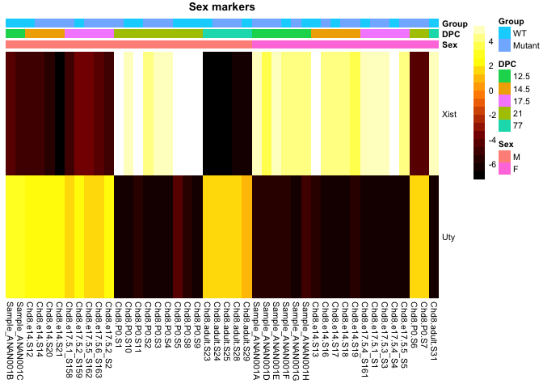<!-- -->

We can clearly see a problem here - Xist is higly expressed in some of the samples annotated as "male", and Uty is highly expressed in some of the annotated "females", and _vice versa_. To help confirm this (and demonstrate another useful kind of plot), here is a detailed plot of Xist.


```r
stripchart(t(d["Xist",]) ~ m$Sex, cex=2, pch=21, 
           ylab="Annotated sex", xlab="Xist expression")
```

<!-- -->

And its ggplot version. Instead of `geom_point`, I'm using `geom_jitter` to avoid overplotting.


```r
d_long %>%
  filter(gene == "Xist") %>%
ggplot(aes(Sex, Expression, color=Sex)) + 
  geom_jitter(width=0.05, height=0, size=3 ) + 
  ggtitle("Expression of Xist") + labs(x="Annotated sex" )
```

<!-- -->

After some further checking by hand, and an email exchange with the senior author of the paper, Paul determined that for the P0 animals, sex was coded as M=2 and F=1 rather than M=1 and F=2 as done for the rest of the data (!). It doesn't seem likely this affected other aspects such as Chd8 genotype.

*For now* I am not going to fix this but of course in any further analysis we need to do so.

# Sample-sample correlations

Next we look at the sample-sample correlation. We are expecting to see a strong pattern, because we see clear DPC-related patterns in random genes.

Note: In general, I suggest that if the correlations are mostly far from 1 to set the diagonal of the correlation matrix to `NA` so it doesn’t dominate the color space; in general ensure color mapping allows range of values to be distinguished. 


```r
cc <- data.frame(cor(d), 
                 row.names = names(d))
range(cc, na.rm=T)
```

```
## [1] 0.3498706 1.0000000
```

```r
# base heatmap
heatmap(as.matrix(cc), 
        scale = "none",
        Rowv=NA, Colv = "Rowv", col=bcols, 
        main="Base heatmap")
```

<!-- -->

And using the `pheatmap` package - more flexible and we can add in annotation bars.


```r
pheatmap(cc, color = bcols, 
         border_color = NA, 
         cluster_rows = F, cluster_cols = F, 
         annotation_col = data.frame(row.names = names(d), 
                                     Group = m$Group, 
                                     Batch=m$SeqRun, 
                                     DPC=factor(m$DPC)), 
         main="pheatmap", fontsize=8, na_col="grey")
```

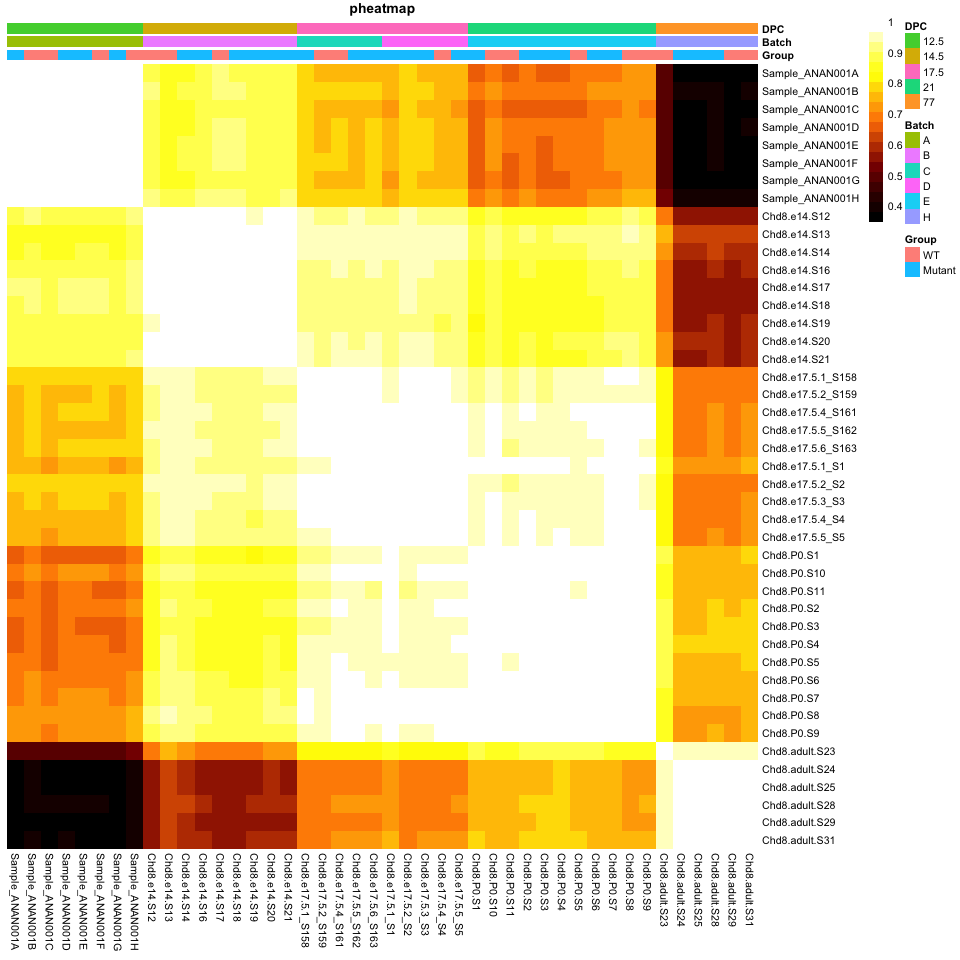<!-- -->

Now using the `ComplexHeatmap` package. This is the most flexible for adding extra features to your plot, but perhaps a little harder to learn. I usually have to look back at the help pages when making a plot with this package, but the results are usually worth it. 

Note that the default color choices for the anntation bars in this package and in `pheatmap` can be less than ideal, but you can specify color palettes (see `RColorBrewer` package).


```r
Heatmap(as.matrix(cc), col=bcols, 
        cluster_rows = FALSE, cluster_columns = FALSE, 
        top_annotation = HeatmapAnnotation(Group = m$Group,
                                           Batch=m$SeqRun, 
                                           DPC=factor(m$DPC)), 
        row_names_gp = gpar(fontsize = 8), 
        column_names_gp = gpar(fontsize = 8), 
        column_title="ComplexHeatmap")
```

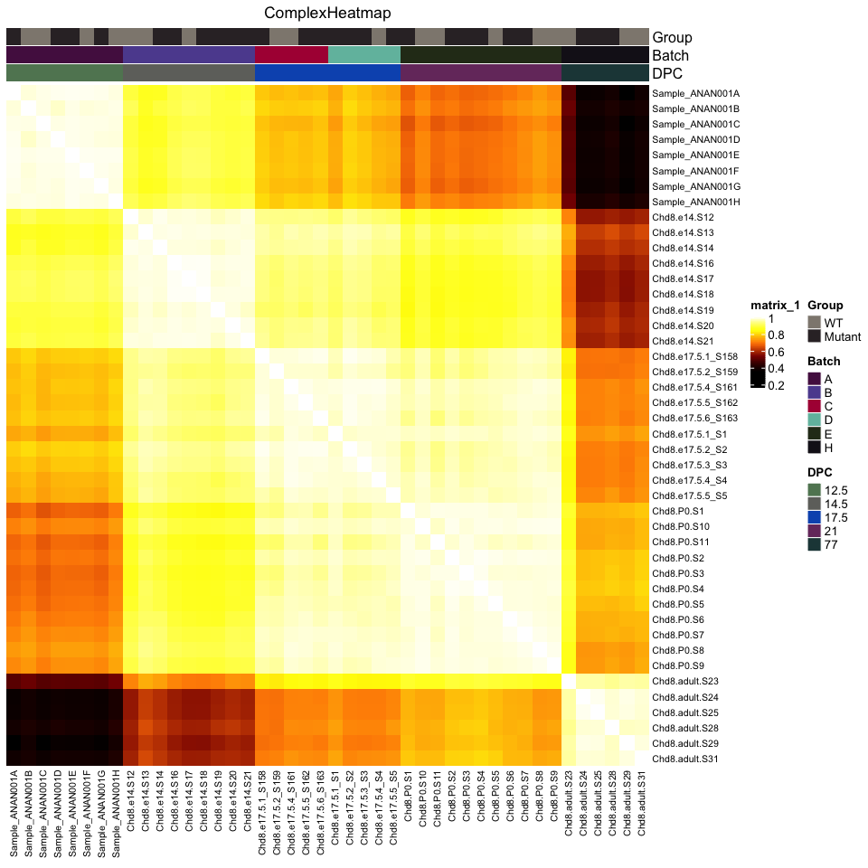<!-- -->

As expected, we see strong shifts across the developmental stages. The range of correlations is from 0.35 to 0.99, which is quite extreme - obviously the expression state is very different between adult and early embryo (The lowest values are from comparing the e12.5 to adult). The correlations seem to drop over increasing spans of developmental time. Also I notice that for the 17.5 day embryos, which were run in two batches, we don't see any obvious difference.

Overall this makes me less worried about the batch confound - the dominant signals look biological. While it's not ideal, for this data set we're going to be mostly interested in the effect of Chd8 mutation, not the effects of time, so it's not a big concern.

I also notice that one of the adult samples seems to be a bit of an outlier - sample Chd8.adult.S23. Inspecting the metadata, this is the sample that has by far the highest number of mapped reads (especially compared to other adult samples); otherwise nothing special about it. Let's look at it a bit more. How bad is this potential outlier? 


```r
round(cor(d[,m$DPC == "77"]),3)
```

```
##                Chd8.adult.S23 Chd8.adult.S24 Chd8.adult.S25 Chd8.adult.S28
## Chd8.adult.S23          1.000          0.953          0.953          0.940
## Chd8.adult.S24          0.953          1.000          0.992          0.977
## Chd8.adult.S25          0.953          0.992          1.000          0.979
## Chd8.adult.S28          0.940          0.977          0.979          1.000
## Chd8.adult.S29          0.953          0.988          0.985          0.968
## Chd8.adult.S31          0.949          0.979          0.977          0.971
##                Chd8.adult.S29 Chd8.adult.S31
## Chd8.adult.S23          0.953          0.949
## Chd8.adult.S24          0.988          0.979
## Chd8.adult.S25          0.985          0.977
## Chd8.adult.S28          0.968          0.971
## Chd8.adult.S29          1.000          0.983
## Chd8.adult.S31          0.983          1.000
```

Correlations for Chd8.adult.S23 are around 0.95 while others are in the range of 0.98-0.99.


```r
pairs(d[,c("Chd8.adult.S23", "Sample_ANAN001A","Chd8.e14.S12" ,"Chd8.e17.5.6_S163","Chd8.adult.S24" )], pch='.')
```

<!-- -->

```r
## ggplot2 version (used to able to do with ggplot2::plotmatrix, but that's gone)
ggpairs(d[,c("Chd8.adult.S23", "Sample_ANAN001A","Chd8.e14.S12" ,"Chd8.e17.5.6_S163","Chd8.adult.S24" )], lower=list(continuous=wrap("points", alpha=0.2, size=0.1)))
```

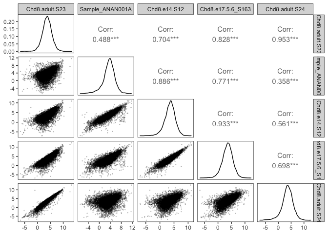<!-- -->

Conclusion: this "outlier" isn't extremely worrying and might be improved if we perform additional normalization later. I'd keep this sample.

The end!

