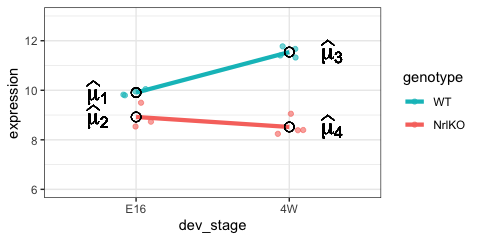
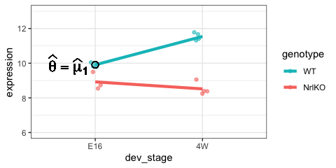
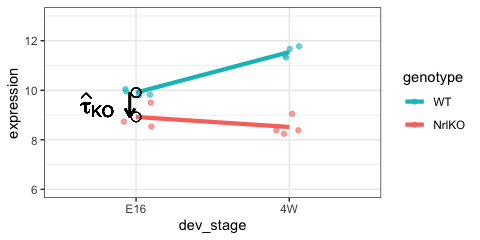
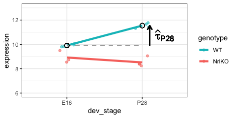
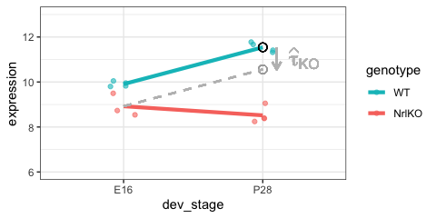
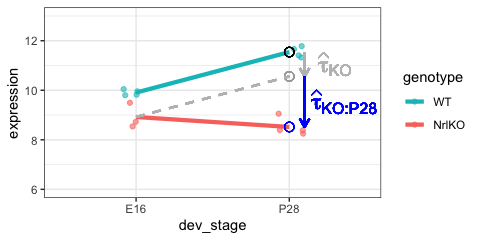
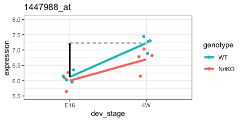
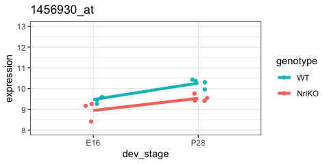

STAT 540: Companion to Lecture 7: Linear Models
================
Keegan Korthauer

- <a href="#two-way-anova-or-a-linear-model-with-interaction"
  id="toc-two-way-anova-or-a-linear-model-with-interaction">Two-way ANOVA
  or a linear model with interaction</a>
  - <a href="#reference-treatment-effect-parametrization"
    id="toc-reference-treatment-effect-parametrization">Reference-treatment
    effect parametrization</a>
  - <a href="#mathematically-a-bit-more-difficult"
    id="toc-mathematically-a-bit-more-difficult">Mathematically (a bit more
    difficult…)</a>
  - <a href="#reference-wt--e16" id="toc-reference-wt--e16">Reference: WT
    &amp; E16</a>
  - <a href="#simple-genotype-effect-wt-vs-nrlko--at-e16-"
    id="toc-simple-genotype-effect-wt-vs-nrlko--at-e16-"><em>Simple</em>
    genotype effect: WT <em>vs</em> NrlKO <font color="blue"> at E16
    </font></a>
  - <a href="#simple-developmental-effect-e16-vs-p28--in-wt-"
    id="toc-simple-developmental-effect-e16-vs-p28--in-wt-"><em>Simple</em>
    developmental effect: E16 <em>vs</em> P28 <font color="blue"> in WT
    </font></a>
  - <a href="#interaction-effect" id="toc-interaction-effect">Interaction
    effect</a>
- <a href="#two-way-anova-without-interaction-additive-models"
  id="toc-two-way-anova-without-interaction-additive-models">Two-way ANOVA
  without interaction: additive models</a>
  - <a href="#mathematically" id="toc-mathematically">Mathematically</a>
- <a href="#some-additional-examples"
  id="toc-some-additional-examples">Some additional examples</a>
  - <a href="#example-4-development-in-wt-is-statistically-significant"
    id="toc-example-4-development-in-wt-is-statistically-significant">Example
    4: development in WT is statistically significant</a>
  - <a
    href="#example-5-both-simple-development-and-genotype-are-statistically-significant"
    id="toc-example-5-both-simple-development-and-genotype-are-statistically-significant">Example
    5: both simple development and genotype are statistically
    significant</a>

Note that the source Rmd for this document can be found
[here](https://github.com/STAT540-UBC/resources/blob/main/linearModels/lect07_companion_linear_models.Rmd)

## Two-way ANOVA or a linear model with interaction

Which group means are we comparing in a model with 2 factors?

For simplicity, we first consider only two levels of `dev_stage`: E16
and P28



$$\mu_1=E[Y_{(WT,E16)}]$$ $$\mu_2=E[Y_{(NrlKO,E16)}]$$
$$\mu_3=E[Y_{(WT,P28)}]$$ $$\mu_4=E[Y_{(NrlKO,P28)}]$$

### Reference-treatment effect parametrization

By default, `lm` assumes a <font color = "red">**reference-treatment
effect**</font> parametrization. We just need *more* indicator
variables!!

### Mathematically (a bit more difficult…)

$$Y_{ijk}=\theta + \tau_{KO} x_{KO,ijk}+ \tau_{P28}  x_{P28,ijk}+ \tau_{KO:P28}  x_{KO,ijk} x_{P28,ijk}+ \varepsilon_{ijk}$$
Subscripts: $i$ indexes samples per group, $j=\{WT, NrlKO\}$,
$k=\{E16, P28\}$

The names of these parameters and variables may look overwhelming but it
helps to think of them as just names for:

> $x_{KO,ijk}$: a indicator variable with value 1 for NrlKO genotype
> samples (any sample with j=NrlKO), and 0 otherwise. I call this
> variable $x_{KO}$

> $x_{P28,ijk}$: a different indicator variable with value 1 for P28
> samples (any sample with k=P28), and 0 otherwise. I call this variable
> $x_{P28}$

> $\tau_{KO}$, $\tau_{P28}$, and $\tau_{KO:P28}$: parameters to model
> the *simple* effects of genotype (NrlKO), development (P28), and their
> interaction

**Note**: in this “simple” version with 2 levels per factor we need only
one indicator variable per factor: $x_{KO}$ and $x_{P28}$. But this
model can be extended to multiple factors with multiple levels. You just
need to add more indicator variables!

### Reference: WT & E16

As before, comparisons are relative to a reference but now we have
reference levels in both factors: **E16** and **WT**

$$Y_{ijk}=\theta + \tau_{KO}  x_{KO,ijk}+ \tau_{P28}  x_{P28,ijk}+ \tau_{KO:P28}  x_{KO,ijk} x_{P28,ijk}+ \varepsilon_{ijk}$$

For any sample $i$ in the reference group: $j=WT$ and $k=E16$, then
$x_{KO}=0$ and $x_{P28}=0$ (I’m omiting subscripts for clarity). Then
only $\theta$ remains and we get: $$E[Y_{WT,E16}]=\theta$$

as before $\theta$ is the mean of the reference group



Here is the `lm` output table for the two factor fit (extracted using
`broom::tidy()`).

``` r
twoFactFit <- lm(expression ~ genotype * dev_stage, oneGene)
tidy(twoFactFit)
```

    ## # A tibble: 4 × 5
    ##   term                       estimate std.error statistic  p.value
    ##   <chr>                         <dbl>     <dbl>     <dbl>    <dbl>
    ## 1 (Intercept)                   9.91      0.157     62.9  2.02e-15
    ## 2 genotypeNrlKO                -0.984     0.240     -4.09 1.78e- 3
    ## 3 dev_stageP28                  1.64      0.223      7.35 1.44e- 5
    ## 4 genotypeNrlKO:dev_stageP28   -2.04      0.328     -6.23 6.47e- 5

Notice that the **`lm` estimate**, $\hat{\theta}$, is the sample mean of
the reference group (WT E16).

``` r
(means.2Fact <- group_by(oneGene, dev_stage, genotype) %>% 
          summarize(cellMeans = mean(expression)) %>%
          ungroup() %>%
          mutate(txEffects = cellMeans - cellMeans[1],
                 lmEst = tidy(twoFactFit)$estimate))
```

    ## `summarise()` has grouped output by 'dev_stage'. You can override using the
    ## `.groups` argument.

    ## # A tibble: 4 × 5
    ##   dev_stage genotype cellMeans txEffects  lmEst
    ##   <fct>     <fct>        <dbl>     <dbl>  <dbl>
    ## 1 E16       WT            9.91     0      9.91 
    ## 2 E16       NrlKO         8.92    -0.984 -0.984
    ## 3 P28       WT           11.5      1.64   1.64 
    ## 4 P28       NrlKO         8.52    -1.39  -2.04

To show this explicitly, we pull out the `lm` estimate for the reference
group (WT E16):

``` r
means.2Fact %>% 
  filter(dev_stage == "E16" & genotype == "WT") %>%
  pull(lmEst)
```

    ## [1] 9.906954

And now the sample mean of the reference group (WT E16):

``` r
means.2Fact %>%
  filter(dev_stage == "E16" & genotype == "WT") %>%
  pull(cellMeans)
```

    ## [1] 9.906954

### *Simple* genotype effect: WT *vs* NrlKO <font color="blue"> at E16 </font>

$$Y_{ijk}=\theta + \tau_{KO}  x_{KO,ijk}+ \tau_{P28}  x_{P28,ijk}+ \tau_{KO:P28}  x_{KO,ijk} x_{P28,ijk}+ \varepsilon_{ijk}$$

For any WT sample at E16: $x_{KO}=0$ and $x_{P28}=0$. Then
<font color="red"> $E[Y_{WT,E16}]=\theta$ </font>

For any KO sample at E16: $x_{KO}=1$ and $x_{P28}=0$. Then
<font color="red"> $E[Y_{NrlKO,E16}]=\theta + \tau_{KO}$ </font>

Substracting these expectations we get $\tau_{KO}$, the *conditional*
genotype effect <font color="blue"> at E16 </font>:

$$\tau_{KO}=E[Y_{NrlKO,E16}]-E[Y_{WT,E16}]$$



And its **`lm` estimate**, $\hat{\tau}_{KO}$, is the *difference* of
sample respective means.

To show this explicitly, we pull out the `lm` estimate for the KO effect
(diff between E16:NrlKO and E16:WT):

``` r
means.2Fact %>% 
  filter(dev_stage == "E16" & genotype == "NrlKO") %>%
  pull(lmEst)
```

    ## [1] -0.9844049

And now the differences in sample means between the E16:NrlKO group and
the reference group (WT E16):

``` r
means.2Fact %>% 
  filter(dev_stage == "E16" & genotype == "NrlKO") %>%
  pull(txEffects)
```

    ## [1] -0.9844049

### *Simple* developmental effect: E16 *vs* P28 <font color="blue"> in WT </font>

$$Y_{ijk}=\theta + \tau_{KO}  x_{KO,ijk}+ \tau_{P28}  x_{P28,ijk}+ \tau_{KO:P28}  x_{KO,ijk} x_{P28,ijk}+ \varepsilon_{ijk}$$

For any WT sample at E16: $x_{KO}=0$ and $x_{P28}=0$. Then
<font color="red"> $E[Y_{WT,E16}]=\theta$ </font>

For any WT sample at P28: $x_{KO}=0$ and $x_{P28}=1$. Then
<font color="red"> $E[Y_{WT,P28}]=\theta + \tau_{P28}$ </font>

Substracting these expectations we get $\tau_{P28}$, the *conditional*
development effect <font color="blue"> in WT </font>:

$$\tau_{P28}=E[Y_{WT,P28}]-E[Y_{WT,E16}]$$



And its **`lm` estimate**, $\hat{\tau}_{P28}$, is the *difference* of
respective sample means.

To show this explicitly, we pull out the `lm` estimate for the P28
effect (diff between P28:WT and E16:WT):

``` r
means.2Fact %>% 
  filter(dev_stage == "P28" & genotype == "WT") %>%
  pull(lmEst)
```

    ## [1] 1.636609

And now the differences in sample means between the E16:NrlKO group and
the reference group (WT E16):

``` r
means.2Fact %>% 
  filter(dev_stage == "P28" & genotype == "WT") %>%
  pull(txEffects)
```

    ## [1] 1.636609

### Interaction effect

Can we simply add up the simple effect of genotype NrlKO, and the simple
effect of developmental stage P28, to get the effect at P28 in NrlKO??
If so, we’d expect the P28:NrlKO group to have a mean predicted by the
dotted grey line (i.e.**that the effect of KO is the same at E16 as it
is at P28**:



We see that this does not seem to be the case. This is where the
**interaction** effect comes in. Let’s see what it means mathematically.

$$Y_{ijk}=\theta + \tau_{KO}  x_{KO,ijk}+ \tau_{P28}  x_{P28,ijk}+ \tau_{KO:P28}  x_{KO,ijk} x_{P28,ijk}+ \varepsilon_{ijk}$$

For any KO sample at P28: $x_{KO}=1$ and $x_{P28}=1$. Then
<font color="red">
$E[Y_{NrlKO,P28}]=\theta + \tau_{KO} + \tau_{P28} + \tau_{KO:P28}$
</font>

Using the expectations from above, you can show that:

$$\tau_{KO:P28}= (E[Y_{NrlKO,P28}]-E[Y_{WT,P28}]) - (E[Y_{NrlKO,E16}]-E[Y_{WT,E16}]) $$

This term is represented by the blue arrow:

    ## Warning: Using `size` aesthetic for lines was deprecated in ggplot2 3.4.0.
    ## ℹ Please use `linewidth` instead.



And its **`lm` estimate**, $\hat{\tau}_{KO:P28}$, is the *difference of
the differences* between NrlKO and WT at each developmental stage.

To show this explicitly, we pull out the `lm` estimate for the
interaction effect:

``` r
means.2Fact %>% 
  filter(dev_stage == "P28" & genotype == "NrlKO") %>%
  pull(lmEst)
```

    ## [1] -2.040372

And now the differences in sample means between the E16:NrlKO group and
the reference group (WT E16):

``` r
mean.E16.WT <- means.2Fact %>% filter(dev_stage == "E16" & genotype == "WT") %>% pull(cellMeans)
mean.E16.KO <- means.2Fact %>% filter(dev_stage == "E16" & genotype == "NrlKO") %>% pull(cellMeans)
mean.P28.WT <- means.2Fact %>% filter(dev_stage == "P28" & genotype == "WT") %>% pull(cellMeans)
mean.P28.KO <- means.2Fact %>% filter(dev_stage == "P28" & genotype == "NrlKO") %>% pull(cellMeans)

(mean.P28.KO - mean.P28.WT) - (mean.E16.KO - mean.E16.WT) 
```

    ## [1] -2.040372

## Two-way ANOVA without interaction: additive models

The interpretation of the coefficients changed when we drop the
interaction terms

### Mathematically

$$Y_{ijk}=\theta + \tau_{KO}  x_{KO,ijk}+ \tau_{P28}  x_{P28,ijk} + \varepsilon_{ijk}$$
Note that this model is simpler and it has fewer parameters! but what do
these mean?

As before, let’s look at the expectations of each group:

- for any sample $i$ with $j=WT$ and $k=E16$: $x_{KO}=0$ and $x_{P28}=0$
  (only $\theta$ remains): $$E[Y_{WT,E16}]=\theta$$

- for any sample $i$ with $j=WT$ and $k=P28$: $x_{KO}=0$ and
  $x_{P28}=1$: $$E[Y_{WT,P28}]=\theta + \tau_{P28}$$

- for any sample $i$ with $j=NrlKO$ and $k=E16$: $x_{KO}=1$ and
  $x_{P28}=0$: $$E[Y_{KO,E16}]=\theta + \tau_{KO}$$

- for any sample $i$ with $j=NrlKO$ and $k=P28$: $x_{KO}=1$ and
  $x_{P28}=1$: $$E[Y_{KO,P28}]=\theta + \tau_{KO} + \tau_{P28}$$

After some simple algebra, you get:

$$(E[Y_{WT,P28}]-E[Y_{WT,E16}]) + (E[Y_{KO,P28}]-E[Y_{KO,E16}]) = 2 \tau_{P28}$$

Then,

$$\tau_{P28}= (\text{Eff}_{P28|WT} + \text{Eff}_{P28|KO})/2$$ is the
average effect of P28 over the levels of `genotype`!!

Similar for the other *main effect*.

The intercept parameter is now
$\bar{Y} - \bar{x}_{ij,KO}\hat{\tau}_{KO} - \bar{x}_{ij,P28}\hat{\tau}_{P28}$

## Some additional examples

### Example 4: development in WT is statistically significant

Here is an example gene which has only the effect of developmental stage
significant (in WT). The other two terms are not significant (effect of
genotype at E16 and interaction).



    ## # A tibble: 4 × 5
    ##   term                       estimate std.error statistic  p.value
    ##   <chr>                         <dbl>     <dbl>     <dbl>    <dbl>
    ## 1 (Intercept)                   6.12      0.143    42.8   1.37e-13
    ## 2 genotypeNrlKO                -0.119     0.218    -0.547 5.95e- 1
    ## 3 dev_stageP28                  1.11      0.202     5.47  1.94e- 4
    ## 4 genotypeNrlKO:dev_stageP28   -0.412     0.298    -1.39  1.93e- 1

Again, the interaction effect is not significant, so there may be a
development effect *regardless* of the genotype. Or likewise a genotype
effect *regardless* of developmental stage. We need to test those
hypotheses (main effects) using `anova`

``` r
anova(multFit)
```

    ## Analysis of Variance Table
    ## 
    ## Response: expression
    ##                    Df  Sum Sq Mean Sq F value    Pr(>F)    
    ## genotype            1 0.28444 0.28444  3.4808   0.08896 .  
    ## dev_stage           1 3.11838 3.11838 38.1606 6.933e-05 ***
    ## genotype:dev_stage  1 0.15690 0.15690  1.9200   0.19331    
    ## Residuals          11 0.89889 0.08172                      
    ## ---
    ## Signif. codes:  0 '***' 0.001 '**' 0.01 '*' 0.05 '.' 0.1 ' ' 1

We see that there is indeed a significant main effect of developmental
stage. But the main effect of genotype is not significant.

### Example 5: both simple development and genotype are statistically significant

but not the interaction… note the almost parallel pattern



    ## # A tibble: 4 × 5
    ##   term                       estimate std.error statistic  p.value
    ##   <chr>                         <dbl>     <dbl>     <dbl>    <dbl>
    ## 1 (Intercept)                   9.47      0.127    74.6   3.11e-16
    ## 2 genotypeNrlKO                -0.526     0.194    -2.71  2.02e- 2
    ## 3 dev_stageP28                  0.795     0.180     4.43  1.01e- 3
    ## 4 genotypeNrlKO:dev_stageP28   -0.209     0.264    -0.791 4.45e- 1

Note that the main effects for both are also significant (but not the
interaction).

    ## Analysis of Variance Table
    ## 
    ## Response: expression
    ##                    Df  Sum Sq Mean Sq F value    Pr(>F)    
    ## genotype            1 1.29452 1.29452 20.0799 0.0009298 ***
    ## dev_stage           1 1.81238 1.81238 28.1126 0.0002516 ***
    ## genotype:dev_stage  1 0.04039 0.04039  0.6265 0.4453874    
    ## Residuals          11 0.70915 0.06447                      
    ## ---
    ## Signif. codes:  0 '***' 0.001 '**' 0.01 '*' 0.05 '.' 0.1 ' ' 1
