RNA-seq examples
================
Paul Pavlidis and Keegan Korthauer

- <a href="#introduction" id="toc-introduction">Introduction</a>
- <a href="#setup" id="toc-setup">Setup</a>
- <a href="#preparing-for-analysis"
  id="toc-preparing-for-analysis">Preparing for analysis</a>
  - <a href="#loading-and-preparing-data"
    id="toc-loading-and-preparing-data">Loading and preparing data</a>
    - <a href="#sequencing-space" id="toc-sequencing-space">Sequencing
      space</a>
  - <a href="#counts-to-cpm" id="toc-counts-to-cpm">Counts to CPM</a>
  - <a href="#setting-up-our-design-matrix"
    id="toc-setting-up-our-design-matrix">Setting up our design matrix</a>
- <a href="#differential-expression-analysis"
  id="toc-differential-expression-analysis">Differential expression
  analysis</a>
  - <a href="#using-standard-linear-model"
    id="toc-using-standard-linear-model">Using standard linear model</a>
  - <a href="#using-limma-on-log2cpm" id="toc-using-limma-on-log2cpm">Using
    limma on log2cpm</a>
    - <a href="#bonus-topic-p-value-distribution"
      id="toc-bonus-topic-p-value-distribution">Bonus topic: P-value
      distribution</a>
  - <a href="#using-limma-trend" id="toc-using-limma-trend">Using
    limma-trend</a>
  - <a href="#using-limma-voom" id="toc-using-limma-voom">Using
    limma-voom</a>
  - <a href="#using-limma-voom-with-tmm"
    id="toc-using-limma-voom-with-tmm">Using limma-voom with TMM</a>
  - <a href="#using-edger-lrt" id="toc-using-edger-lrt">Using edgeR LRT</a>
    - <a href="#likelihood-ratio-test-lrt"
      id="toc-likelihood-ratio-test-lrt">Likelihood ratio test (LRT)</a>
  - <a href="#using-edger-quasi-likelihood"
    id="toc-using-edger-quasi-likelihood">Using edgeR Quasi-likelihood</a>
  - <a href="#using-deseq2" id="toc-using-deseq2">Using DESeq2</a>
- <a href="#heatmaps-of-top-genes-limma-voom"
  id="toc-heatmaps-of-top-genes-limma-voom">Heatmaps of top genes
  (limma-voom)</a>
  - <a href="#bonus-topic-heatmap-with-adjusted-data-limma-trend"
    id="toc-bonus-topic-heatmap-with-adjusted-data-limma-trend">Bonus topic:
    Heatmap with adjusted data (limma-trend)</a>
- <a href="#comparing-methods" id="toc-comparing-methods">Comparing
  methods</a>
  - <a href="#differences-between-limma-trend-and-limma-voom"
    id="toc-differences-between-limma-trend-and-limma-voom">Differences
    between limma-trend and limma-voom</a>

# Introduction

This file provides code, context and additional information related to
the STAT540 lecture on RNA-seq analysis.

Among other things it shows how to run differential expression analysis
on RNA-seq data sets using a variety of methods. We’ll get a sense at
how the results differ across methods, though obviously doing this on a
single data set is not a real evaluation. The example data set is the
same “Gompers” Chd8 mutant data set we introduced in lecture 1.

# Setup

First we’ll make sure the necessary packages are installed. If any of
the following are not installed on your system, please run the
corresponding lines of code from the code chunk below (currently set to
`eval = FALSE`).

``` r
library(BiocManager)
install("tidyverse")
install("limma")
install("DESeq2")
install("edgeR")
install("pheatmap")
install("qvalue")
install("GGally")
install("UpSetR")
install("statmod")
```

Next, we’ll load these libraries and set some plotting defaults.

``` r
knitr::opts_chunk$set(echo = TRUE)
library(tidyverse)
library(limma)
library(DESeq2)
library(edgeR)
library(pheatmap)
library(qvalue) 
library(GGally)
library(UpSetR)

bcols<-colorRampPalette(c("#000000" ,"#800000" ,"#FF8000" ,"#FFFF00", "#FFFFFF"))(20)
# Set some defaults for ggplot2.
theme_set(theme_bw(base_size = 16))
theme_update(panel.grid.major = element_blank(), panel.grid.minor = element_blank())
```

# Preparing for analysis

## Loading and preparing data

We will use the same dataset as introduced in [lecture
1](https://stat540-ubc.github.io/lectures/lectures_2021/lect03-eda.html#1).
This is the data from [Gompers et al.,
2017](https://www.ncbi.nlm.nih.gov/pubmed/28671691), that is available
on GEO, at [Accession
GSE99331](https://www.ncbi.nlm.nih.gov/geo/query/acc.cgi?acc=GSE99331).
However, note that this data is only publicly available as RPKM values,
*not* raw counts. As raw counts are preferable for differential
expression analysis, Paul Pavlidis obtained these counts directly from
the authors in Jan 2018. If you’d like to get more acquainted with this
dataset before proceeding, here is a [markdown document going over some
preliminary
EDA](https://github.com/STAT540-UBC/STAT540-UBC.github.io/blob/master/examples/exploration-examples/explore.md).

Notes:

- we are using a corrected version of the meta-data obtained from the
  authors that fixes the miscoded sex for P0 animals

- following the nomenclature of the authors, “Group” indicates the Chd8
  genotype (wild type or heterozygous mutant), “DPC” indicates “Days
  post conception” (developmental stage)

First, we’ll read in the metadata, and recode the categorical variables
as factors with meaningful levels - so we don’t have to remember whether
`Sex = 1` refers to male or female.

``` r
m <- read.csv("nn.4592-S4.fixed.csv") %>%
   mutate(Sample = Sample.ID) %>%
   column_to_rownames(var = "Sample.ID") %>%
   select(-Number)

m <- m %>% 
   dplyr::rename(DPC = `Stage..DPC.`,
                 Sex = `Sex..1.male.`,
                 Group = `Group..1.WT.`,
                 SeqRun = `SeqRun`,
                 MappedReads = `Mapped.Reads`,
                 FeatureCounts = `Feature.Counts`) %>%
   mutate(Sex = factor(Sex, labels = c("M", "F")),
          Group = factor(Group, labels = c("WT", "Mu")),
          SeqRun = factor(SeqRun),
          DPC = factor(DPC))
```

Next, we’ll read in the feature counts.

``` r
counts <- read.table("Gompers_NN_CountMatrix.txt", 
                     header = TRUE, row.names = 1)
```

We’ll check that the sample IDs in the columns of our count matrix match
*exactly* the sample IDs in the rows of our metadata.

``` r
identical(colnames(counts), rownames(m))
```

    ## [1] TRUE

Great!

Now, we’ll do some preliminary filtering to remove rows that are all
zeroes (not expressed in any sample). We’ll do more filtering later.

``` r
dim(counts)
```

    ## [1] 24015    44

``` r
counts <- counts %>% filter(rowSums(.) > 0)
dim(counts)
```

    ## [1] 20962    44

### Sequencing space

Here we examine the “soaker” genes (just looking at the most extreme
case).

``` r
soaker <- which.max(rowMeans(counts))
soaker
```

    ## Rn45s 
    ## 15860

``` r
rowMeans(counts)[soaker]
```

    ##    Rn45s 
    ## 222291.8

We see that gene Rn45s has mean expression 2.222918^{5}. Let’s look at a
distribution of expression values across samples for this gene.

``` r
data.frame(count = as.numeric(counts[soaker,])) %>%
  ggplot() +
    geom_density(aes(x = count)) 
```

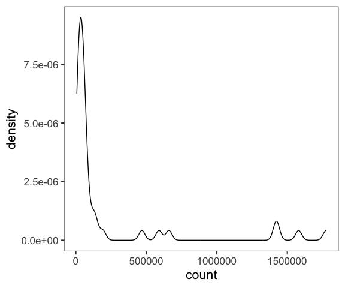<!-- -->

Next, let’s look at the relationship between counts of this gene, and
total number of reads in the sample.

``` r
data.frame(count = as.numeric(counts[soaker,]),
           total = colSums(counts)) %>%
  ggplot(aes(x = count, y = total)) +
    geom_point() + 
    xlab("Rn45s raw read count") +
    ylab("Total reads in sample")
```

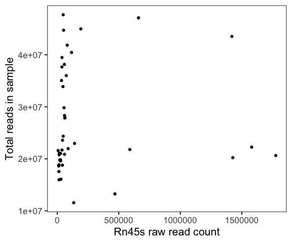<!-- -->

In some samples, this gene has over 1e6 reads - it’s an outlier even
relative to the sample.

Let’s calculate the proportion of all reads mapping to this one gene.

``` r
frcrn45s <- counts[soaker,]/ colSums(counts)
quantile(frcrn45s)
```

    ## Warning in xtfrm.data.frame(x): cannot xtfrm data frames

    ##                 0%         25%         50%         75%       100%
    ## Rn45s 0.0003286862 0.001003311 0.001826259 0.003166741 0.08605762

This one gene is up to 8.6% of the reads! This is not unusual.

Let’s look at the cumulative distribution of the number of reads per
gene.

``` r
cpgcum <- data.frame(apply(counts, 2, function(x) cumsum(sort(x))/sum(x)), 
                     index = (1:dim(counts)[1])/dim(counts)[1]) %>%
  pivot_longer(names_to = "Sample", values_to = "CumulativeFracCounts", 
               cols = -index)
ggplot(cpgcum, aes(x = index, y = CumulativeFracCounts, group = Sample)) + 
  geom_hline(yintercept = 0.5, color="grey", linetype = "dashed") + 
  geom_vline(xintercept = c(0.95), color="grey", linetype = "dashed") + 
  geom_line(show.legend = FALSE, aes(color = Sample), alpha = 0.5) +
  xlab("Proportion of genes") +
  ylab("Cumulative proportion of total counts")
```

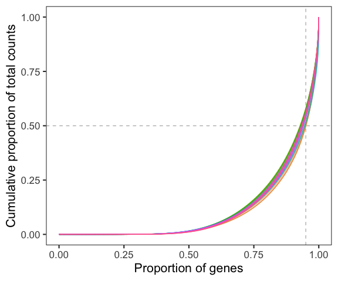<!-- -->

From this we see that for most samples, the top \~5% of genes (vertical
dashed line) make up approximately 50% of the counts (horizontal dashed
line)!

## Counts to CPM

CPM (counts per million mapped reads) can be a useful transformation for
visualization, since it removes the variation in counts among different
samples that is due to the total number of reads in each sample.

The log2 transformation is another useful transformation for
visualization, since we saw in the previous section that the
distribution of raw counts is right-skewed. Since counts can have a
value of zero, we have to add a pseudocount before taking the log. We’ll
use a value of 1, so we compute log2(CPM + 1).

First we show two separate ways to compute CPM: (1) by ‘hand’, and (2)
using `edgeR::cpm()`:

``` r
# 1) by hand
totalReads <- colSums(counts)
cpm1 <- t(apply(counts, 1, function(x) x/totalReads*10^6))

# 2) using edgeR::cpm
cpm2 <- cpm(counts, log = FALSE, normalized.lib.sizes = FALSE)

all.equal(cpm1, cpm2)
```

    ## [1] TRUE

Things are getting unwieldy with counts, CPM, and metadata in separate
objects. Let’s create a `SummarizedExperiment` object to house them all
in one container. Recall that `SummarizedExperiment` is a generalization
of `ExpressionSet` that allows us to store more than one expression
matrix (“assay”) - this will be useful for us to store both the counts
and the log(CPM + 1) values.

``` r
sumexp <- SummarizedExperiment(assays = SimpleList(counts = as.matrix(counts)), 
                             colData = DataFrame(m))

assays(sumexp)$cpm <- cpm(counts, log = FALSE, normalized.lib.sizes = FALSE)
sumexp
```

    ## class: SummarizedExperiment 
    ## dim: 20962 44 
    ## metadata(0):
    ## assays(2): counts cpm
    ## rownames(20962): 0610005C13Rik 0610007P14Rik ... Zzef1 Zzz3
    ## rowData names(0):
    ## colnames(44): Sample_ANAN001A Sample_ANAN001B ... Chd8.adult.S29
    ##   Chd8.adult.S31
    ## colData names(7): DPC Sex ... FeatureCounts Sample

Now we can see that the raw counts are in the `counts` slot and CPM are
in the `cpm` slot of `assays(sumexp)`.

Next, we’ll create a filter for lowly expressed genes. Specifically,
we’ll use the threshold used by the authors: only keep genes with at
least 2 samples that have CPM greater than 10.

``` r
keep <- which(rowSums(assays(sumexp)$cpm > 10) >= 2)
length(keep)  
```

    ## [1] 12158

``` r
sumexp <- sumexp[keep,]
```

Note that the filtering step subsetted both the raw counts and the CPM
matrix.

And now we’ll compute log2(CPM + 1) for these filtered genes, and add to
a slot we’ll call `log2cpm`.

``` r
assays(sumexp)$log2cpm <- log2(assays(sumexp)$cpm + 1)
sumexp
```

    ## class: SummarizedExperiment 
    ## dim: 12158 44 
    ## metadata(0):
    ## assays(3): counts cpm log2cpm
    ## rownames(12158): 0610007P14Rik 0610009B22Rik ... Zzef1 Zzz3
    ## rowData names(0):
    ## colnames(44): Sample_ANAN001A Sample_ANAN001B ... Chd8.adult.S29
    ##   Chd8.adult.S31
    ## colData names(7): DPC Sex ... FeatureCounts Sample

Now, let’s examine the distribution of log2(CPM + 1) for our ‘soaker’
gene. Note that since we’ve filtered, we can’t use the same index as
before (1.586^{4}), so we’ll subset the `SummarizedExperiment` object by
the name of the soaker gene (Rn45s).

``` r
data.frame(log2cpm = as.numeric(assays(sumexp[names(soaker),])$log2cpm)) %>%
  ggplot() +
    geom_density(aes(x = log2cpm)) +
    xlab("log2(CPM + 1)")
```

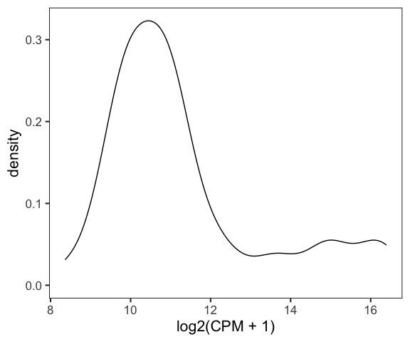<!-- -->

## Setting up our design matrix

To run a differential expression analysis, we first have to set up a
design matrix. First, we decide which factors to include in the model. I
want to use Group, DPC and Sex. SeqRun is confounded with DPC so I don’t
use it.

(Note: in the paper, they say they correct for Sex as well as both
SeqRun and DPC, but in the R script they provide, they actually only use
SeqRun. That does correct for both at the same time because of the
confound. But I am going to use DPC anyway as the batch effect for the
one time point that was run in two batches seemed minor).

tldr: We’re going to use Sex, Group and DPC in the model, no
interactions.

``` r
modm <- model.matrix(~ Sex + Group + DPC, data = colData(sumexp))

head(modm)
```

    ##                 (Intercept) SexF GroupMu DPC14.5 DPC17.5 DPC21 DPC77
    ## Sample_ANAN001A           1    1       1       0       0     0     0
    ## Sample_ANAN001B           1    0       0       0       0     0     0
    ## Sample_ANAN001C           1    0       0       0       0     0     0
    ## Sample_ANAN001D           1    1       1       0       0     0     0
    ## Sample_ANAN001E           1    1       1       0       0     0     0
    ## Sample_ANAN001F           1    1       0       0       0     0     0

# Differential expression analysis

## Using standard linear model

It’s not unreasonable to ask whether just using standard linear models
on log2(CPM + 1) would be okay. Remember the problems with this are
supposed to be:

- Counts have non-normal behaviour (motivating `edgeR` and `DESeq`)
- Accounting for mean-variance effects is important (motivating
  limma-voom and limma-trend)
- Using moderation of the variance estimates is a good idea.

We’ll see how much this matters (for this particular data set).

In this section we’ll use the base `lm` approach on log2(CPM + 1). In
the next section we’ll bring in the moderated t statistics (`eBayes`)
and weighted regression (`voom`) and other variations on that theme,
followed by the `edgeR` and `DESeq2` methods.

We are just going to keep all the results from the different runs in a
data frame so we can compare them later (just the p-values for “Group”).

Note: The `limma` package fits linear models efficiently *en masse*, but
then adds other features that we want to see the effect of, while still
using the rest of the limma workflow (e.g. `topTable`). To do so we need
to turn off the extras (specifically variance shrinkage and degrees of
freedom adjustment), but `limma` does not provide any built-in way to do
that. Therefore, I provide [some
code](https://github.com/STAT540-UBC/resources/blob/main/rnaseqdiffex-examples/noBayes.R)
that lets you use the usual limma workflow, but without the bells and
whistles; I call it `noBayes` to replace `eBayes`. Essentially, it hacks
the `limma` output and replaces the moderated results with the standard
`lm` results so that we can operate onit with `topTable`. In using
`noBayes` we don’t get the `B` statistic so you have to specify
`sort.by = "p"` in the call to `topTable`, since `sort.by="B"` is the
default when examining single coefficients.

``` r
# run the function to hack the limma output to be lm output 
source("noBayes.R")
lmlogcpm <- lmFit(assays(sumexp)$log2cpm, design = modm)
lmlogcpm <- noBayes(lmlogcpm) 
```

We’ll print the top 10 genes by `lm` for the Sex, Group, and DPC
covariates, then save the results for Group in the dataframe we’ll add
other results to.

``` r
topTable(lmlogcpm, number = 10, coef = "SexF", sort.by = "p")  # sex
```

    ##                    logFC  AveExpr          t      P.Value    adj.P.Val
    ## Ddx3y         -5.8697805 2.419431 -95.057666 8.111898e-46 9.862445e-42
    ## Xist           8.2072064 5.524871  67.234989 2.765639e-40 1.681232e-36
    ## Kdm5d         -5.4074398 2.130757 -58.809346 3.748147e-38 1.518999e-34
    ## Uty           -4.5456105 1.819027 -54.280450 7.032875e-37 2.137642e-33
    ## Eif2s3y       -5.4040271 2.174713 -39.218603 9.579370e-32 2.329320e-28
    ## Kdm6a          0.5334235 5.617558   9.968761 4.996264e-12 1.012410e-08
    ## Eif2s3x        0.6479423 4.271539   8.288993 5.867119e-10 1.019035e-06
    ## 5530601H04Rik  0.4903023 3.757509   6.476082 1.427792e-07 2.169887e-04
    ## Kdm5c          0.3201610 7.324809   6.055220 5.285808e-07 7.140539e-04
    ## Pbdc1          0.3656907 4.773626   4.956618 1.612849e-05 1.960901e-02

``` r
topTable(lmlogcpm, number = 10, coef = "GroupMu", sort.by = "p")  # group
```

    ##              logFC  AveExpr          t      P.Value    adj.P.Val
    ## Chd8    -0.5752382 7.119133 -10.889344 4.277262e-13 5.200295e-09
    ## Vrk3     0.2311065 5.012246   6.790790 5.394690e-08 2.249816e-04
    ## Git1     0.1629843 7.868139   6.781500 5.551446e-08 2.249816e-04
    ## Dnajc4   0.3106221 3.547794   6.687639 7.417046e-08 2.254411e-04
    ## Lrrc48   0.3562182 3.053709   5.892215 8.787116e-07 2.136675e-03
    ## Parva    0.2575209 6.027494   5.634803 1.961414e-06 3.974479e-03
    ## Hmgcll1 -0.2502977 4.687811  -5.575087 2.362859e-06 4.103948e-03
    ## Anxa11   0.3610589 2.149160   5.513723 2.860932e-06 4.347901e-03
    ## Mtrr     0.2231728 3.989127   5.461864 3.362643e-06 4.542557e-03
    ## Mbtps2  -0.1906449 5.601007  -5.425997 3.760056e-06 4.571476e-03

``` r
topTable(lmlogcpm, number =10, coef = c("DPC14.5", "DPC17.5", "DPC21", "DPC77")) # DPC
```

    ##          DPC14.5   DPC17.5     DPC21     DPC77  AveExpr        F      P.Value
    ## Rps23  -7.237540 -7.758854 -7.782795 -7.604795 1.733041 4305.364 8.247956e-49
    ## Rps13  -7.202030 -7.542979 -7.559957 -7.544650 1.794908 3681.531 1.482295e-47
    ## Rpl28  -7.535123 -7.480228 -7.102245 -7.795321 2.206374 2928.403 1.010066e-45
    ## Rps29  -7.583209 -7.604292 -7.489372 -7.763519 1.804189 2720.614 3.923275e-45
    ## Rpl19  -7.379356 -7.824504 -7.931219 -7.590126 2.297790 2432.830 3.079881e-44
    ## Rpl36a -6.173804 -6.480819 -6.628506 -6.324045 1.683624 2334.821 6.570024e-44
    ## Rps16  -6.283539 -6.647790 -6.574086 -6.800874 1.855359 2187.318 2.185955e-43
    ## Gapdh  -8.093534 -8.309696 -7.879648 -7.930588 3.097617 2084.215 5.318848e-43
    ## Rpsa   -6.629828 -7.346022 -7.506683 -8.041747 3.934573 1956.133 1.709777e-42
    ## Rps17  -7.281908 -7.393224 -7.523904 -7.723445 2.134778 1895.928 3.039795e-42
    ##           adj.P.Val
    ## Rps23  1.002787e-44
    ## Rps13  9.010874e-44
    ## Rpl28  4.093459e-42
    ## Rps29  1.192479e-41
    ## Rpl19  7.489039e-41
    ## Rpl36a 1.331306e-40
    ## Rps16  3.796691e-40
    ## Gapdh  8.083320e-40
    ## Rpsa   2.309719e-39
    ## Rps17  3.695783e-39

``` r
# Start to collect the data from the different methods.
difmethods <- data.frame(row.names = row.names(sumexp))
difmethods$lmlogcpm <- topTable(lmlogcpm, number = Inf, coef = "GroupMu", sort.by = "none")$P.Value
```

## Using limma on log2cpm

Now we repeat, using regular `limma` with `eBayes`, as if this was a
microarray data set.

``` r
limmalogcpm <- lmFit(assays(sumexp)$log2cpm, design = modm)
limmalogcpm <- eBayes(limmalogcpm)
plotSA(limmalogcpm, main = "Default limma")
```

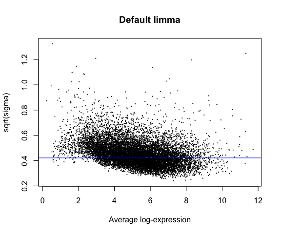<!-- -->

``` r
topTable(limmalogcpm, number = 10, coef = "SexF", sort.by = "p")  # sex
```

    ##                    logFC  AveExpr          t      P.Value    adj.P.Val
    ## Ddx3y         -5.8697805 2.419431 -95.203058 4.861801e-50 5.910978e-46
    ## Xist           8.2072064 5.524871  70.040978 1.447373e-44 8.798582e-41
    ## Kdm5d         -5.4074398 2.130757 -60.616331 5.360536e-42 2.172446e-38
    ## Uty           -4.5456105 1.819027 -55.670901 1.730835e-40 5.260873e-37
    ## Eif2s3y       -5.4040271 2.174713 -40.979745 4.353356e-35 1.058562e-31
    ## Kdm6a          0.5334235 5.617558   9.819702 2.297957e-12 4.656427e-09
    ## Eif2s3x        0.6479423 4.271539   8.465140 1.444636e-10 2.509126e-07
    ## 5530601H04Rik  0.4903023 3.757509   6.599339 5.873485e-08 8.926229e-05
    ## Kdm5c          0.3201610 7.324809   5.955243 4.877075e-07 6.588387e-04
    ## Pbdc1          0.3656907 4.773626   5.041597 9.643786e-06 1.172492e-02
    ##                       B
    ## Ddx3y         75.050571
    ## Xist          71.580243
    ## Kdm5d         69.376332
    ## Uty           67.890039
    ## Eif2s3y       61.358057
    ## Kdm6a         18.029033
    ## Eif2s3x       14.038440
    ## 5530601H04Rik  8.218915
    ## Kdm5c          6.167892
    ## Pbdc1          3.284835

``` r
topTable(limmalogcpm, number = 10, coef = "GroupMu", sort.by = "p")   # group
```

    ##              logFC  AveExpr          t      P.Value    adj.P.Val         B
    ## Chd8    -0.5752382 7.119133 -10.823715 1.237803e-13 1.504920e-09 19.212349
    ## Dnajc4   0.3106221 3.547794   6.537689 7.190446e-08 4.371072e-04  7.778548
    ## Vrk3     0.2311065 5.012246   6.260586 1.787107e-07 7.242547e-04  6.965740
    ## Lrrc48   0.3562182 3.053709   5.938174 5.158506e-07 1.567928e-03  6.016657
    ## Git1     0.1629843 7.868139   5.614300 1.493450e-06 3.232032e-03  5.062541
    ## Anxa11   0.3610589 2.149160   5.594215 1.595015e-06 3.232032e-03  5.003425
    ## Parva    0.2575209 6.027494   5.495447 2.203655e-06 3.827433e-03  4.712906
    ## Hmgcll1 -0.2502977 4.687811  -5.422666 2.795292e-06 4.248146e-03  4.499069
    ## Xrcc4    0.3031190 3.842087   5.368758 3.332959e-06 4.502457e-03  4.340844
    ## Mtrr     0.2231728 3.989127   5.230369 5.230274e-06 6.358968e-03  3.935440

``` r
topTable(limmalogcpm, number =10, coef = c("DPC14.5", "DPC17.5", "DPC21", "DPC77")) # DPC
```

    ##          DPC14.5   DPC17.5     DPC21     DPC77  AveExpr        F      P.Value
    ## Rps23  -7.237540 -7.758854 -7.782795 -7.604795 1.733041 4105.000 4.131900e-53
    ## Rps13  -7.202030 -7.542979 -7.559957 -7.544650 1.794908 3566.014 7.506346e-52
    ## Rpl28  -7.535123 -7.480228 -7.102245 -7.795321 2.206374 2910.686 4.910542e-50
    ## Rps29  -7.583209 -7.604292 -7.489372 -7.763519 1.804189 2737.465 1.735817e-49
    ## Rpl19  -7.379356 -7.824504 -7.931219 -7.590126 2.297790 2482.826 1.293723e-48
    ## Rpl36a -6.173804 -6.480819 -6.628506 -6.324045 1.683624 2307.056 5.856418e-48
    ## Rps16  -6.283539 -6.647790 -6.574086 -6.800874 1.855359 2185.256 1.786157e-47
    ## Gapdh  -8.093534 -8.309696 -7.879648 -7.930588 3.097617 2166.237 2.137769e-47
    ## Rpsa   -6.629828 -7.346022 -7.506683 -8.041747 3.934573 2017.231 9.248037e-47
    ## Rps17  -7.281908 -7.393224 -7.523904 -7.723445 2.134778 1962.266 1.631406e-46
    ##           adj.P.Val
    ## Rps23  5.023564e-49
    ## Rps13  4.563108e-48
    ## Rpl28  1.990079e-46
    ## Rps29  5.276017e-46
    ## Rpl19  3.145816e-45
    ## Rpl36a 1.186706e-44
    ## Rps16  3.102300e-44
    ## Gapdh  3.248875e-44
    ## Rpsa   1.249307e-43
    ## Rps17  1.983464e-43

``` r
difmethods$limmalogcpm <- topTable(limmalogcpm, number = Inf, coef = "GroupMu", 
                                   sort.by = "none")$P.Value
```

We see there’s a bit of a decreasing mean-variance trend here. We’ll
next try out the limma-trend method to adjust for this.

Note that the prior degrees of freedom are the extra degrees of freedom
we get for using `eBayes`.

``` r
limmalogcpm$df.prior
```

    ## [1] 4.316442

### Bonus topic: P-value distribution

An essential diagnostic after doing this kind of statistical analysis
(not exclusive to RNA-seq, but for any high-dimensional analysis) is to
examine the distribution of the p-values, because those p-values are
used to estimate false discovery rates, which in turn depend on p-values
following some sort of expected behaviour.

Options here include looking at p-value distributions (I recommend) or
quantile-quantile plots of p-values. Quantile-quantile plots (not shown
here) are also often used to examine test statistics.

``` r
hist(topTable(limmalogcpm, number = Inf, coef = "SexF")$P.Value, breaks=100, 
     xlab = "P-value",
     main="Pval dist for 'Sex' (limma on logcpm)")
```

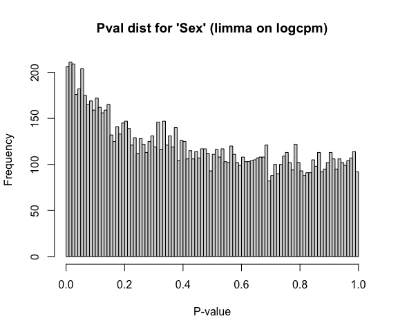<!-- -->

``` r
hist(topTable(limmalogcpm, number = Inf, coef = "GroupMu")$P.Value, breaks=100, 
     xlab = "P-value",
     main="Pval dist for 'Group' (limma on logcpm)")
```

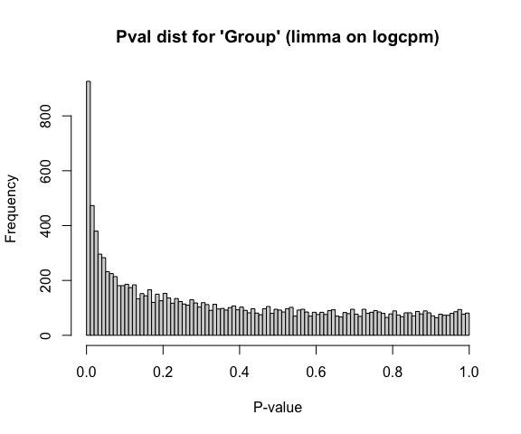<!-- -->

``` r
hist(topTable(limmalogcpm, number = Inf, coef = c("DPC14.5", "DPC17.5", "DPC21", "DPC77"))$P.Value,
     breaks=100, xlab = "P-value",
     main="Pval dist for 'DPC' (limma on logcpm)") 
```

<!-- -->

If we don’t observe a relatively flat distribution for most of the range
(in particular, apart from a possible spike of low p-values), this
suggests there might be a problem with our data/model resulting in
inaccurate p-values.

Visualizing the p-value distributions you get a sense of how much of a
“signal” there is, but this can be quantified using the
`qvalue::qvalue()` method. The output `pi_0` is the estimated fraction
of “true null hypotheses” while `1 - pi_0` or `pi_1` is the estimated
(in this case) fraction of differentially expressed genes (with respect
to the selected coefficients in the linear model we are fitting). This
is useful, though wouldn’t take these numbers too seriously, especially
if your p-value distribution is at all “defective”.

``` r
# Check pi0 estimates from qvalue
1 - qvalue(topTable(limmalogcpm, number = Inf, coef = "SexF")$P.Value)$pi0
```

    ## [1] 0.1624529

``` r
1 - qvalue(topTable(limmalogcpm, number = Inf, coef = "GroupMu")$P.Value)$pi0 # this is the one we care about
```

    ## [1] 0.3495736

``` r
# For DPC, qvalue breaks because basically every gene is diff expr - basically 100%
1 - qvalue(topTable(limmalogcpm, Inf, coef = c("DPC14.5", "DPC17.5", "DPC21", "DPC77"))$P.Value)$pi0 
```

    ## [1] 0.9976912

## Using limma-trend

Here we start to get into the mean-variance relationships and how they
can be addressed. Limma-trend is a modification to the standard limma
approach that incorporates mean expression level as a covariate into the
prior hyperparameter estimation. Its goal is to adjust for any
mean-variance relationship still leftover after transformation using log
CPM. If we *don’t* do this, we may be shrinking some genes too much, or
too little, depending on their variance levels. Limma-trend is robust if
the sequencing depth is “reasonably consistent” across samples
(according to the user manual, less than 3-fold range, which is not
quite the case here - see below). The way limma-trend works is the mean
expression level is used as a covariate in the prior hyperparameter
estimation.

``` r
# note that the maximum depth is more than 4-fold higher than the minimum
max(colSums(assays(sumexp)$counts)/min(colSums(assays(sumexp)$counts)))
```

    ## [1] 4.126548

``` r
limmatrend <- lmFit( assays(sumexp)$log2cpm, design = modm)
limmatrend <- eBayes(limmatrend, trend = TRUE) # trend=TRUE is the only diff from regular limma.
plotSA(limmatrend, main = "limma-trend") 
```

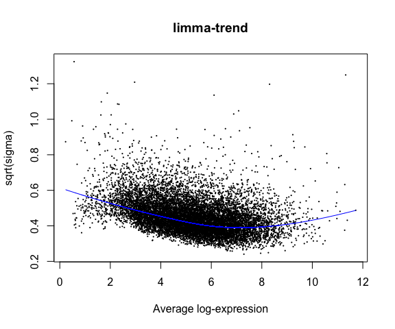<!-- -->

We can see the mean-variance trend estimated by limma-trend in the blue
line. Next we’ll examine the top ten genes by Sex, Group and DPC, as
well as add the p-values for Group for the limma-trend approach to our
data frame of results.

``` r
topTable(limmatrend, number = 10, coef = "SexF", sort.by = "p") 
```

    ##                    logFC  AveExpr          t      P.Value    adj.P.Val
    ## Ddx3y         -5.8697805 2.419431 -89.272399 9.810469e-50 1.192757e-45
    ## Xist           8.2072064 5.524871  70.745532 1.694616e-45 1.030157e-41
    ## Kdm5d         -5.4074398 2.130757 -58.719315 4.091675e-42 1.658220e-38
    ## Uty           -4.5456105 1.819027 -53.115414 2.673693e-40 8.126688e-37
    ## Eif2s3y       -5.4040271 2.174713 -40.624211 1.778809e-35 4.325351e-32
    ## Kdm6a          0.5334235 5.617558   9.902048 1.419374e-12 2.876126e-09
    ## Eif2s3x        0.6479423 4.271539   8.421492 1.395818e-10 2.424336e-07
    ## 5530601H04Rik  0.4903023 3.757509   6.505446 7.273079e-08 1.105326e-04
    ## Kdm5c          0.3201610 7.324809   6.068016 3.110107e-07 4.201409e-04
    ## Pbdc1          0.3656907 4.773626   5.042973 9.150790e-06 1.112553e-02
    ##                       B
    ## Ddx3y         75.210179
    ## Xist          72.490478
    ## Kdm5d         69.610347
    ## Uty           67.777245
    ## Eif2s3y       61.886945
    ## Kdm6a         18.468644
    ## Eif2s3x       14.058503
    ## 5530601H04Rik  8.011313
    ## Kdm5c          6.606029
    ## Pbdc1          3.344271

``` r
topTable(limmatrend, number = 10, coef = "GroupMu", sort.by = "p") 
```

    ##              logFC  AveExpr          t      P.Value    adj.P.Val         B
    ## Chd8    -0.5752382 7.119133 -11.017655 5.356310e-14 6.512201e-10 19.912599
    ## Dnajc4   0.3106221 3.547794   6.238283 1.766439e-07 8.757041e-04  6.970287
    ## Vrk3     0.2311065 5.012246   6.177633 2.160810e-07 8.757041e-04  6.790083
    ## Git1     0.1629843 7.868139   5.777619 8.153323e-07 2.441004e-03  5.600334
    ## Lrrc48   0.3562182 3.053709   5.714836 1.003868e-06 2.441004e-03  5.413653
    ## Parva    0.2575209 6.027494   5.571887 1.610920e-06 3.264261e-03  4.988965
    ## Hmgcll1 -0.2502977 4.687811  -5.351353 3.333385e-06 5.789614e-03  4.335408
    ## Anxa11   0.3610589 2.149160   5.292146 4.049474e-06 6.154188e-03  4.160420
    ## Xrcc4    0.3031190 3.842087   5.244602 4.733310e-06 6.394175e-03  4.020084
    ## Mbtps2  -0.1906449 5.601007  -5.070478 8.365993e-06 9.352325e-03  3.507730

``` r
topTable(limmatrend, number = 10, coef = c("DPC14.5", "DPC17.5", "DPC21", "DPC77"))
```

    ##          DPC14.5   DPC17.5     DPC21     DPC77  AveExpr        F      P.Value
    ## Rps23  -7.237540 -7.758854 -7.782795 -7.604795 1.733041 3175.401 9.812187e-52
    ## Rps13  -7.202030 -7.542979 -7.559957 -7.544650 1.794908 2839.630 1.029680e-50
    ## Rpl28  -7.535123 -7.480228 -7.102245 -7.795321 2.206374 2490.655 1.621811e-49
    ## Rps29  -7.583209 -7.604292 -7.489372 -7.763519 1.804189 2310.931 7.826065e-49
    ## Rpl19  -7.379356 -7.824504 -7.931219 -7.590126 2.297790 2214.734 1.911976e-48
    ## Gapdh  -8.093534 -8.309696 -7.879648 -7.930588 3.097617 2055.142 9.197127e-48
    ## Rpsa   -6.629828 -7.346022 -7.506683 -8.041747 3.934573 1964.021 2.383368e-47
    ## Rpl36a -6.173804 -6.480819 -6.628506 -6.324045 1.683624 1873.345 6.428290e-47
    ## Rps16  -6.283539 -6.647790 -6.574086 -6.800874 1.855359 1831.899 1.028031e-46
    ## Thy1    2.917807  5.643646  6.762117  9.528292 5.067655 1807.779 1.357675e-46
    ##           adj.P.Val
    ## Rps23  1.192966e-47
    ## Rps13  6.259423e-47
    ## Rpl28  6.572658e-46
    ## Rps29  2.378733e-45
    ## Rpl19  4.649161e-45
    ## Gapdh  1.863644e-44
    ## Rpsa   4.139569e-44
    ## Rpl36a 9.769393e-44
    ## Rps16  1.388755e-43
    ## Thy1   1.650662e-43

``` r
# add limma trend results to master results table
difmethods$limmatrend <- topTable(limmatrend, number = Inf, coef = "GroupMu", sort = "none")$P.Value 
```

## Using limma-voom

Now we introduce the weighted regression method suggested by the limma
developers to utilize the raw counts (instead of using log-transformed
CPM values) - this is called voom. It’s worth noting that in the
original voom paper, voom was a bit better than ‘trend’.

Note that we are using the `counts` slot of `assays(sumexp)` now instead
of the `log2cpm` slot.

``` r
# voom() takes counts, NOT cpm. 
vw <- voom(assays(sumexp)$counts, design = modm, plot = TRUE, span = 0.5)  
```

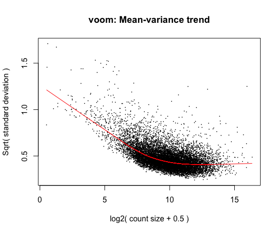<!-- -->

We see the characteristic mean-variance relationship that the voom
weights will adjust for.

``` r
lmvoom <- lmFit(vw, modm)
lmvoom <- eBayes(lmvoom)
plotSA(lmvoom, main= "voom")
```

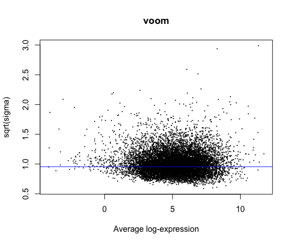<!-- -->

With the limma-voom adjustment, we see the trend between mean and
variance is largely gone.

Now we’ll look at the top 10 signficant for Sex, Group, and DPC, and add
the p-values for the Group coefficient to our comparison table.

``` r
topTable(lmvoom, number = 10, coef = "SexF", sort.by = "p") 
```

    ##                     logFC    AveExpr          t      P.Value    adj.P.Val
    ## Kdm5d         -10.4047655 -0.8064703 -41.894609 4.324862e-36 5.258168e-32
    ## Uty            -9.3716955 -1.0833585 -38.195359 1.960770e-34 1.191952e-30
    ## Ddx3y         -10.5200807 -0.3448537 -33.272254 5.608562e-32 2.272963e-28
    ## Xist            9.9731580  4.6980141  22.981114 1.569246e-25 4.769722e-22
    ## Eif2s3y       -10.4319614 -0.7349739 -19.418654 1.068643e-22 2.598513e-19
    ## Kdm6a           0.5553789  5.5955184  10.117086 7.248421e-13 1.468772e-09
    ## Eif2s3x         0.6709886  4.1841419   8.651544 6.592784e-11 1.145072e-07
    ## 5530601H04Rik   0.5172651  3.6503268   6.272796 1.559888e-07 2.370639e-04
    ## Kdm5c           0.3213212  7.3247264   6.042268 3.358159e-07 4.536499e-04
    ## Pbdc1           0.3797234  4.7248174   5.151175 6.391060e-06 7.770251e-03
    ##                       B
    ## Kdm5d         44.563162
    ## Uty           43.963588
    ## Ddx3y         42.273439
    ## Xist          41.166512
    ## Eif2s3y       32.671118
    ## Kdm6a         19.049053
    ## Eif2s3x       14.677173
    ## 5530601H04Rik  7.031586
    ## Kdm5c          5.936412
    ## Pbdc1          3.206580

``` r
topTable(lmvoom, number = 10, coef = "GroupMu", sort.by = "p") 
```

    ##             logFC   AveExpr          t      P.Value    adj.P.Val         B
    ## Chd8   -0.5775219  7.117845 -10.997813 5.488676e-14 6.673132e-10 21.655891
    ## Plin4   2.0680684 -1.859445   7.529917 2.443131e-09 1.389053e-05  8.375762
    ## Anxa11  0.5918950  1.677268   7.426542 3.427503e-09 1.389053e-05 10.361997
    ## Dnajc4  0.3601611  3.426896   6.458451 8.413009e-08 2.557134e-04  7.844650
    ## Vrk3    0.2297994  4.975781   5.975140 4.197830e-07 1.020744e-03  6.337295
    ## Lrrc48  0.4349115  2.853108   5.887879 5.609919e-07 1.096707e-03  6.011005
    ## Xdh     0.9856836 -2.581746   5.852265 6.314318e-07 1.096707e-03  4.507211
    ## Git1    0.1632624  7.871134   5.782047 7.971839e-07 1.185210e-03  5.649183
    ## Etnppl  0.8203707 -3.585293   5.753165 8.773553e-07 1.185210e-03  4.667148
    ## Parva   0.2649303  6.013305   5.697285 1.055961e-06 1.283838e-03  5.412379

``` r
topTable(lmvoom, number = 10, coef = c("DPC14.5", "DPC17.5", "DPC21", "DPC77"))
```

    ##         DPC14.5   DPC17.5     DPC21     DPC77  AveExpr        F      P.Value
    ## Rpsa  -6.806586 -7.623041 -7.805699 -8.511633 3.719540 2030.582 9.513641e-48
    ## Gapdh -8.661437 -8.996751 -8.354372 -8.411491 2.644143 1605.984 1.322206e-45
    ## Rps7  -6.162970 -6.525516 -6.875998 -7.789751 2.878267 1392.494 2.646586e-44
    ## Hmgb1 -4.243950 -5.305309 -5.766272 -6.269627 4.826733 1339.932 5.936062e-44
    ## Rpl21 -6.300246 -6.319518 -6.221577 -7.094800 3.402056 1317.451 8.467023e-44
    ## Rpl10 -6.580372 -7.041615 -6.718519 -8.516807 2.793617 1119.141 2.591735e-42
    ## Rpl28 -8.801134 -8.692187 -7.910915 -9.580743 1.219016 1099.457 3.759044e-42
    ## Rpl17 -6.796053 -7.165476 -7.389536 -8.119260 2.619785 1096.048 4.011817e-42
    ## Rpl11 -7.041911 -8.459102 -8.114796 -8.306671 2.072771 1086.459 4.822709e-42
    ## Cplx1  2.282539  3.468638  3.895237  6.105746 6.910190 1024.720 1.642220e-41
    ##          adj.P.Val
    ## Rpsa  1.156668e-43
    ## Gapdh 8.037690e-42
    ## Rps7  1.072573e-40
    ## Hmgb1 1.804266e-40
    ## Rpl21 2.058841e-40
    ## Rpl10 5.251719e-39
    ## Rpl28 6.096959e-39
    ## Rpl17 6.096959e-39
    ## Rpl11 6.514943e-39
    ## Cplx1 1.996611e-38

``` r
# add limma voom results to master results table
difmethods$limmavoom <- topTable(lmvoom, number = Inf, coef = "GroupMu", sort = "none")$P.Value 
```

## Using limma-voom with TMM

In the previous, we use just the data without any extra normalization.
The next analysis has this added (using the TMM method from
`edgeR::calcNormFactors`). Later we use the same normalization approach
for `edgeR`.

``` r
dge <- DGEList(assays(sumexp)$counts)
dge <- calcNormFactors(dge)
vwn <- voom(dge, modm )

limmavoomTMM <- lmFit(vwn, modm)
limmavoomTMM <- eBayes(limmavoomTMM)
plotSA(limmavoomTMM, main= "limma voom + TMM")
```

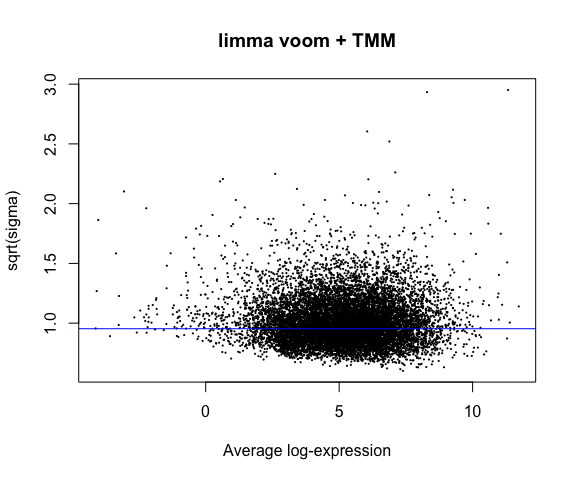<!-- -->

``` r
topTable(limmavoomTMM, number = 10, coef = "SexF", sort.by = "p") 
```

    ##                     logFC    AveExpr          t      P.Value    adj.P.Val
    ## Kdm5d         -10.4042598 -0.8064703 -42.536965 2.716825e-36 3.303116e-32
    ## Uty            -9.3721517 -1.0833585 -39.357050 6.670126e-35 4.054770e-31
    ## Ddx3y         -10.5202698 -0.3448537 -33.450387 5.178505e-32 2.098675e-28
    ## Xist            9.9484991  4.6980141  23.071749 1.484838e-25 4.513167e-22
    ## Eif2s3y       -10.4337306 -0.7349739 -19.069890 2.310250e-22 5.617604e-19
    ## Kdm6a           0.5388143  5.5955184  10.389251 3.338657e-13 6.765232e-10
    ## Eif2s3x         0.6542045  4.1841419   8.406566 1.467302e-10 2.548494e-07
    ## 5530601H04Rik   0.4999480  3.6503268   6.325323 1.324481e-07 2.012881e-04
    ## Kdm5c           0.3071199  7.3247264   5.576876 1.585991e-06 2.142497e-03
    ## Pbdc1           0.3618295  4.7248174   5.124262 7.023776e-06 8.539507e-03
    ##                       B
    ## Kdm5d         44.896253
    ## Uty           44.475937
    ## Ddx3y         42.502272
    ## Xist          41.365163
    ## Eif2s3y       32.360907
    ## Kdm6a         19.807940
    ## Eif2s3x       13.864846
    ## 5530601H04Rik  7.168571
    ## Kdm5c          4.383454
    ## Pbdc1          3.084287

``` r
topTable(limmavoomTMM, number = 10, coef = "GroupMu", sort.by = "p") 
```

    ##              logFC   AveExpr          t      P.Value    adj.P.Val         B
    ## Chd8    -0.5870558  7.117845 -11.321242 2.267412e-14 2.756720e-10 22.494110
    ## Plin4    2.0846016 -1.859445   7.606572 1.935009e-09 1.176292e-05  8.502431
    ## Anxa11   0.5874013  1.677268   7.216964 6.930134e-09 2.808552e-05  9.743049
    ## Dnajc4   0.3497505  3.426896   6.838114 2.418152e-08 7.349974e-05  9.007544
    ## Vrk3     0.2195629  4.975781   5.988008 4.061104e-07 9.874979e-04  6.368986
    ## Etnppl   0.8282525 -3.585293   5.852876 6.359142e-07 1.143753e-03  4.916617
    ## Xdh      0.9959300 -2.581746   5.842344 6.585187e-07 1.143753e-03  4.463451
    ## Hmgcll1 -0.2776781  4.639676  -5.738006 9.305967e-07 1.414274e-03  5.581892
    ## Lrrc48   0.4250691  2.853108   5.692887 1.080567e-06 1.459726e-03  5.411957
    ## Mtrr     0.2427254  3.904952   5.581369 1.562616e-06 1.899829e-03  5.117930

``` r
topTable(limmavoomTMM, number = 10, coef = c("DPC14.5", "DPC17.5", "DPC21", "DPC77"))
```

    ##         DPC14.5   DPC17.5     DPC21     DPC77  AveExpr        F      P.Value
    ## Rpsa  -6.919406 -7.641856 -7.795462 -8.297036 3.719540 2136.564 4.181135e-48
    ## Gapdh -8.771227 -9.010387 -8.344980 -8.204446 2.644143 1655.034 8.878789e-46
    ## Rps7  -6.274067 -6.543071 -6.865180 -7.579119 2.878267 1492.614 7.736043e-45
    ## Rpl21 -6.412828 -6.338060 -6.210448 -6.887297 3.402056 1360.796 5.363740e-44
    ## Hmgb1 -4.356194 -5.324815 -5.755497 -6.058639 4.826733 1321.720 9.870597e-44
    ## Rpl10 -6.689510 -7.055086 -6.708512 -8.303337 2.793617 1218.378 5.421680e-43
    ## Rpl17 -6.906711 -7.179531 -7.377949 -7.908791 2.619785 1188.216 9.158148e-43
    ## Rpl28 -8.909694 -8.703818 -7.900730 -9.370952 1.219016 1162.739 1.440874e-42
    ## Rpl11 -7.152108 -8.474612 -8.105295 -8.093362 2.072771 1149.471 1.831569e-42
    ## Rpl31 -5.040360 -5.276260 -5.723734 -5.669920 3.410514 1091.018 5.451625e-42
    ##          adj.P.Val
    ## Rpsa  5.083424e-44
    ## Gapdh 5.397416e-42
    ## Rps7  3.135160e-41
    ## Rpl21 1.630309e-40
    ## Hmgb1 2.400134e-40
    ## Rpl10 1.098613e-39
    ## Rpl17 1.590640e-39
    ## Rpl28 2.189768e-39
    ## Rpl11 2.474246e-39
    ## Rpl31 6.628086e-39

``` r
# add limma voom with TMM results to master results table
difmethods$limmavoomTMM <- topTable(limmavoomTMM, number = Inf, coef = "GroupMu", 
                                    sort = "none")$P.Value 
```

## Using edgeR LRT

`edgeR` is quite a different approach than `limma` and its variants
limma-trend and limma-voom. `edgeR` models the counts directly (instead
of log transformed CPM values).

### Likelihood ratio test (LRT)

`edgeR` provides two ways to do the model fitting and hypothesis
testing: Likelihood ratio tests (LRT), and quasi-likelihood F-test.
Starting here with the first approach. Recall that the object we created
above for limma-voom (we called it `dge`) is a `DGEList` that contains
the raw counts. This is the input for `edgeR`. First we add the
normalization factors to the object and visualize them.

``` r
dge <- calcNormFactors(dge, method="TMM")

hist(dge$samples$norm.factors, breaks = 10, xlab = "Norm factor", main = "TMM Normalization factors")
```

<!-- -->

The TMM normalization factors are values approximately centered at 1.
Values less than 1 indicate that high-count genes are monopolizing the
“read space”. Note that if we have a large fraction (i.e. greater than
50%) differentially expressed genes, this violates the assumptions of
normalization methods like TMM.

We proceed by first estimating dispersions (recall that these are
analogous to the gene-specific variances in limma), and plotting these
estimates using the `plotBCV` function.

``` r
# Estimate dispersion while automatically setting prior.df
dge <- estimateDisp(dge, design = modm, robust = TRUE)

# Check prior.df for sanity (can instead set manually with prior.df param in estimateDisp)
range(dge$prior.df)
```

    ## [1] 1.456025 4.617746

``` r
# plot mean var trend
plotBCV(dge,  cex=0.5)
```

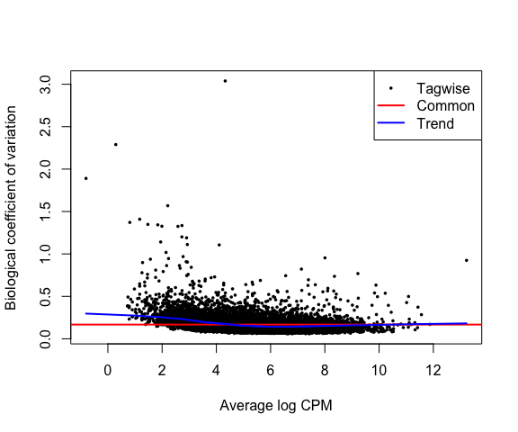<!-- -->

These estimates will be used in fitting the LRT model, which we’ll do
using the `glmFit` function. Then we’ll pull out the top 10 genes with
the `edgeR::topTags` function (similar to `topTable` in `limma`), and
add the p-values for the Group covariate to our results dataframe.

``` r
lfit <- glmFit(dge, modm)

topTags(glmLRT(lfit, coef = "SexF"))$table 
```

    ##                     logFC   logCPM         LR        PValue           FDR
    ## Kdm5d         -10.7195373 3.996977 6216.83218  0.000000e+00  0.000000e+00
    ## Eif2s3y       -10.5508575 4.090526 1655.35313  0.000000e+00  0.000000e+00
    ## Ddx3y         -10.4683213 4.584310 4335.45584  0.000000e+00  0.000000e+00
    ## Uty            -9.6350564 3.159288 4343.85802  0.000000e+00  0.000000e+00
    ## Xist            9.8523916 8.311049 1387.84343 9.206303e-304 2.238605e-300
    ## Kdm6a           0.5338620 5.698533   99.33969  2.127021e-23  4.310053e-20
    ## Eif2s3x         0.6635603 4.679478   63.93119  1.288419e-15  2.237800e-12
    ## 5530601H04Rik   0.5136595 3.724893   40.72263  1.754440e-10  2.666310e-07
    ## Kdm5c           0.3082027 7.410249   27.69496  1.420322e-07  1.918697e-04
    ## Pbdc1           0.3683036 4.895747   24.94333  5.904029e-07  7.178119e-04

``` r
topTags(glmLRT(lfit, coef = "GroupMu"))$table 
```

    ##              logFC   logCPM        LR       PValue          FDR
    ## Chd8    -0.5906606 7.168659 122.72149 1.604640e-28 1.950921e-24
    ## Dnajc4   0.3386763 3.479594  40.50272 1.963426e-10 1.193567e-06
    ## Vrk3     0.2232005 5.019842  33.24769 8.113626e-09 2.471321e-05
    ## Anxa11   0.5191569 2.959509  33.24360 8.130682e-09 2.471321e-05
    ## Hmgcll1 -0.2749039 4.677392  29.43187 5.791743e-08 1.408320e-04
    ## Xrcc4    0.3221447 3.798639  28.12414 1.137780e-07 2.305522e-04
    ## Lrrc48   0.4072922 3.067613  27.64926 1.454279e-07 2.525874e-04
    ## Mtrr     0.2372077 3.938010  25.95035 3.503114e-07 4.639117e-04
    ## Parva    0.2483251 6.155075  25.86456 3.662322e-07 4.639117e-04
    ## Usp11   -0.2683721 7.332362  25.74941 3.887462e-07 4.639117e-04

``` r
topTags(glmLRT(lfit, coef = c("DPC14.5", "DPC17.5", "DPC21", "DPC77")))$table
```

    ##        logFC.DPC14.5 logFC.DPC17.5 logFC.DPC21 logFC.DPC77   logCPM        LR
    ## Rps29      -9.637965     -9.406262   -9.144634  -10.267744 5.596325  8805.983
    ## Rpl5       -9.081222     -9.665479   -9.369362   -9.381689 6.094013  3141.591
    ## Rpl28      -8.936640     -8.683710   -7.899989   -9.382923 5.876428 14388.277
    ## Gapdh      -8.766668     -9.000826   -8.334994   -8.193280 7.253398  9451.582
    ## Rps13      -8.674700     -9.796170   -9.804056   -9.323131 5.464826  9948.090
    ## Rps23      -8.625074    -10.714210  -10.628530   -9.742579 5.547729 12120.883
    ## Rps17      -8.402943     -8.581919   -8.856246   -9.183866 5.810372  7887.321
    ## Rpl19      -8.264809     -8.996156   -9.267205   -8.414900 6.182804 11337.436
    ## Rpl24      -7.980029     -7.917214   -7.979188   -8.784711 4.867295  2964.703
    ## Rpl23a     -7.843216     -7.924164   -7.788970   -6.543794 5.056430  2631.553
    ##        PValue FDR
    ## Rps29       0   0
    ## Rpl5        0   0
    ## Rpl28       0   0
    ## Gapdh       0   0
    ## Rps13       0   0
    ## Rps23       0   0
    ## Rps17       0   0
    ## Rpl19       0   0
    ## Rpl24       0   0
    ## Rpl23a      0   0

``` r
# add edgeRlrt results to master results table
difmethods$edgeRlrt <- topTags(glmLRT(lfit, coef = "GroupMu"), n=Inf, sort.by = "none")$table$PValue 
```

To examine see how much shrinkage we got, we’ll redo the dispersion
estimation, this time forcing `prior.df = 0` (no shrinkage).

``` r
rawd <- estimateDisp(dge, design = modm, prior.df = 0)
plotBCV(rawd, cex=0.5)
```

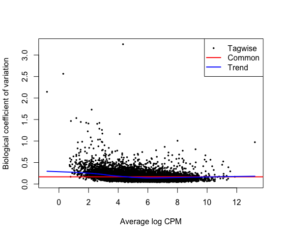<!-- -->

``` r
# Direct comparison
plot( sqrt(rawd$tagwise.dispersion), sqrt(dge$tagwise.dispersion) - sqrt(rawd$tagwise.dispersion),
      pch = 20, xlab = "sqrt Unshrunk disp", ylab = "difference (sqrt Shrunk - sqrt Unshrunk disp)")
abline(0,0, lty=3)
```

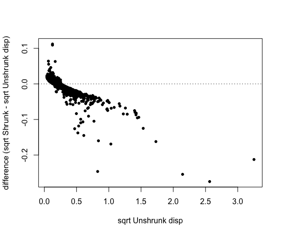<!-- -->

## Using edgeR Quasi-likelihood

The previous section (LRT) is the “traditional” `edgeR` approach. The
newer quasi-likelihood method is generally the preferred method
according to the `edgeR` documentation. It adapts approaches from
limma-trend for adjusting (shrinking) the error variances (`sqeezeVar`).
According to the documentation, edgeR-QL is “more conservative and
rigorous” than edgeR-LR in controlling false discoveries.

Here we’ll use the Quasi-likelihood approach, which is done very
similarly to the traditional LRT, except using functions `glmQLFit()`
and `glmQLFTest()`.

Note that we estimated dispersions the same way as before (with
`estimateDisp`), except now only the trended dispersion is used under
the quasi-likelihood (QL) pipeline.

``` r
dge <- estimateDisp(dge, design = modm, robust = TRUE)

qfit <- glmQLFit(dge, modm)

topTags(glmQLFTest(qfit, coef = "SexF"))$table
```

    ##                     logFC   logCPM          F       PValue          FDR
    ## Kdm5d         -10.7174041 3.996977 4784.31800 1.578049e-44 1.918592e-40
    ## Ddx3y         -10.4642939 4.584310 3625.08292 4.751475e-42 2.888421e-38
    ## Uty            -9.6449085 3.159288 2744.64012 1.427756e-39 5.786218e-36
    ## Eif2s3y       -10.5280880 4.090526 1956.06459 1.436413e-36 4.365976e-33
    ## Xist            9.8363495 8.311049 1767.71446 1.124838e-35 2.735156e-32
    ## Kdm6a           0.5327577 5.698533  107.11350 4.536479e-13 9.192419e-10
    ## Eif2s3x         0.6636832 4.679478   65.60040 4.403407e-10 7.648089e-07
    ## 5530601H04Rik   0.5147258 3.724893   42.93019 6.694390e-08 1.017380e-04
    ## Kdm5c           0.3082256 7.410249   29.76853 2.469134e-06 3.335525e-03
    ## Pbdc1           0.3683890 4.895747   26.19144 7.443244e-06 9.049497e-03

``` r
topTags(glmQLFTest(qfit, coef = "GroupMu"))$table
```

    ##              logFC   logCPM         F       PValue          FDR
    ## Chd8    -0.5907893 7.168659 131.37222 1.915567e-14 2.328946e-10
    ## Dnajc4   0.3338042 3.479594  43.87859 5.282809e-08 3.211419e-04
    ## Vrk3     0.2266556 5.019842  38.93996 1.870674e-07 7.581219e-04
    ## Hmgcll1 -0.2735182 4.677392  32.32170 1.164003e-06 3.537988e-03
    ## Anxa11   0.4985994 2.959509  31.10828 1.658245e-06 3.830713e-03
    ## Xrcc4    0.3212566 3.798639  30.66428 1.890465e-06 3.830713e-03
    ## Lrrc48   0.4076515 3.067613  27.99588 4.233658e-06 5.778018e-03
    ## Usp11   -0.2682525 7.332362  27.68852 4.655516e-06 5.778018e-03
    ## Myef2   -0.2609406 6.466225  27.65248 4.707810e-06 5.778018e-03
    ## Parva    0.2480610 6.155075  27.50144 4.933711e-06 5.778018e-03

``` r
topTags(glmQLFTest(qfit, coef = c("DPC14.5", "DPC17.5", "DPC21", "DPC77")))$table 
```

    ##       logFC.DPC14.5 logFC.DPC17.5 logFC.DPC21 logFC.DPC77   logCPM        F
    ## Rpl28     -8.936340     -8.686645   -7.900251   -9.382342 5.876428 3001.044
    ## Rpsa      -6.876661     -7.631417   -7.791064   -8.278304 7.510997 2547.620
    ## Gapdh     -8.766341     -8.999792   -8.334946   -8.192467 7.253398 2402.727
    ## Rpl19     -8.265044     -8.997104   -9.267438   -8.413620 6.182804 2347.862
    ## Rps7      -6.269546     -6.543893   -6.872611   -7.567293 6.035293 2256.255
    ## Rps13     -8.675073     -9.796394   -9.804063   -9.324877 5.464826 2158.557
    ## Rpl11     -7.097496     -8.440054   -8.112254   -8.055585 6.177988 2053.325
    ## Rps23     -8.621146    -10.709068  -10.630968   -9.728684 5.547729 2042.292
    ## Rps17     -8.403311     -8.585531   -8.857564   -9.180149 5.810372 1921.873
    ## Rps29     -9.640166     -9.400490   -9.144444  -10.272330 5.596325 1851.579
    ##             PValue          FDR
    ## Rpl28 1.553417e-50 1.888644e-46
    ## Rpsa  4.603543e-49 2.798494e-45
    ## Gapdh 1.545224e-48 6.262277e-45
    ## Rpl19 2.491223e-48 7.572071e-45
    ## Rps7  5.672039e-48 1.379213e-44
    ## Rps13 1.416097e-47 2.869485e-44
    ## Rpl11 3.977689e-47 6.756840e-44
    ## Rps23 4.446021e-47 6.756840e-44
    ## Rps17 1.560237e-46 2.107707e-43
    ## Rps29 3.368154e-46 4.095002e-43

``` r
# add edgeRquasi results to master results table
difmethods$edgeRquasi <- topTags(glmQLFTest(qfit, coef = "GroupMu"), n=Inf, 
                                 sort.by = "none")$table$PValue 
```

Comparing the p-values for the LRT and QL approach, we see that both
approaches give similar p-values, but the QL approach shrinks very
significant values a bit less significant.

``` r
df <- data.frame(lrt = -log10(difmethods$edgeRlrt),
                 diff = -log10(difmethods$edgeRquasi) + log10(difmethods$edgeRlrt)) 
df %>% ggplot() +
  geom_point(aes(x = lrt, y = diff), alpha = 0.1) + 
  geom_hline(yintercept = 0, linetype = "dashed", colour = "red") + 
  ylim(-3,3) + xlim(0,10) +
  xlab("-log10 p-value LRT") +
  ylab("Difference QL - LRT (-log10 pval)")
```

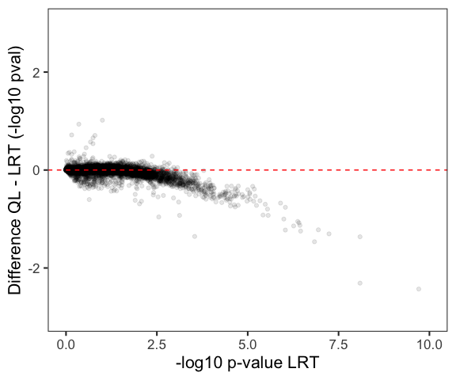<!-- -->

## Using DESeq2

Finally, we’ll compare using `DESeq2`, a method similar to `edgeR` that
also directly models the raw counts.

First we have to construct a `DESeqDataSet` object. This is easy to do
given a `SummarizedExperiment` object and design formula, which we
already have:

``` r
dds <- DESeqDataSet(sumexp, modm)
dds
```

    ## class: DESeqDataSet 
    ## dim: 12158 44 
    ## metadata(1): version
    ## assays(3): counts cpm log2cpm
    ## rownames(12158): 0610007P14Rik 0610009B22Rik ... Zzef1 Zzz3
    ## rowData names(0):
    ## colnames(44): Sample_ANAN001A Sample_ANAN001B ... Chd8.adult.S29
    ##   Chd8.adult.S31
    ## colData names(7): DPC Sex ... FeatureCounts Sample

We’ll compare the `DEseq` size factors to the TMM normalization factors.
Note that we don’t normally need to manually add the normalization size
factors with `estimateSizeFactors`, because automatically run for us in
the `DESeq` function, but we’ll do so here so we can pull them out to
compare with TMM.

``` r
dds <- estimateSizeFactors(dds)
# double check that samples are in the same order in both edger and deseq objects
identical(colnames(dge), colnames(dds))
```

    ## [1] TRUE

``` r
plot(dge$samples$norm.factors, colData(dds)$sizeFactor, pch = 20,
     xlab = "TMM normalization factors", ylab = "DESeq2 size factors")
abline(0,1, lty = 3)
```

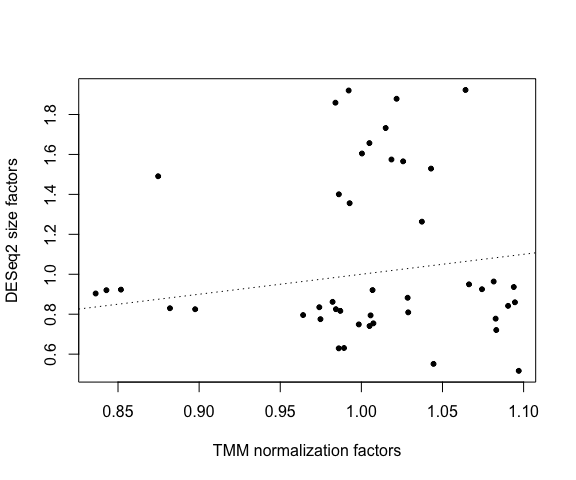<!-- -->

``` r
plot(dge$samples$norm.factors, colSums(counts), pch = 20,
     xlab = "TMM normalization factors", ylab = "depth")
```

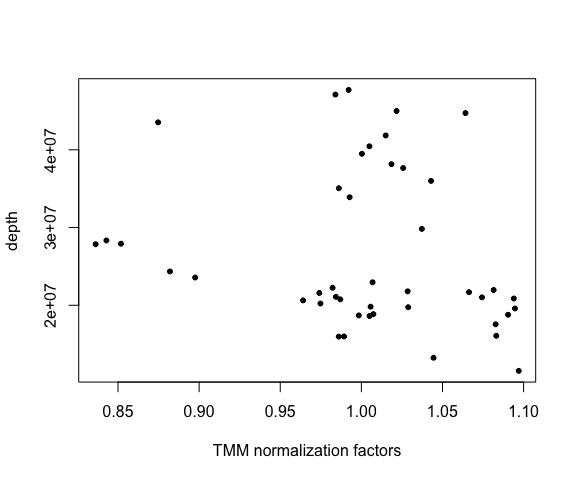<!-- -->

``` r
plot(colData(dds)$sizeFactor, colSums(counts), pch = 20,
     xlab = "DESeq2 size factors", ylab = "depth")
```

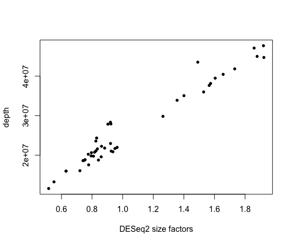<!-- -->

There’s not a huge amount of agreement between the DESeq2 size factors
and the TMM normalization factors. The DESeq2 factors are much more
correlated with depth than TMM.

Next, we run the analysis and pull out the results table for the Group
comparison (`results` is analogous to limma’s `topTable` and edgeR’s
`topTags` functions). We’ll also add those p-values to our results
object.

``` r
dds <- DESeq(dds)
```

    ## using supplied model matrix

    ## using pre-existing size factors

    ## estimating dispersions

    ## gene-wise dispersion estimates

    ## mean-dispersion relationship

    ## final dispersion estimates

    ## fitting model and testing

``` r
resultsNames(dds)
```

    ## [1] "Intercept" "SexF"      "GroupMu"   "DPC14.5"   "DPC17.5"   "DPC21"    
    ## [7] "DPC77"

``` r
deseq_group <- results(dds, name = "GroupMu")

# top genes for Chd8 group
head( deseq_group[ order(deseq_group$pvalue), ] )
```

    ## log2 fold change (MLE): GroupMu 
    ## Wald test p-value: GroupMu 
    ## DataFrame with 6 rows and 6 columns
    ##          baseMean log2FoldChange     lfcSE      stat      pvalue        padj
    ##         <numeric>      <numeric> <numeric> <numeric>   <numeric>   <numeric>
    ## Chd8     3559.907      -0.595924 0.0531048 -11.22165 3.19249e-29 3.80513e-25
    ## Dnajc4    276.096       0.334895 0.0512012   6.54076 6.12065e-11 3.64760e-07
    ## Vrk3      799.700       0.217710 0.0345255   6.30578 2.86745e-10 1.13924e-06
    ## Hmgcll1   633.353      -0.279578 0.0494532  -5.65339 1.57318e-08 4.68767e-05
    ## Anxa11    194.990       0.514626 0.0930202   5.53241 3.15858e-08 7.52943e-05
    ## Xrcc4     343.153       0.317501 0.0582208   5.45339 4.94196e-08 9.81721e-05

``` r
# add deseq2 results to master results table
difmethods$deseq2 <-  deseq_group$pvalue
```

Here’s an MA plot for the Group comparisons, with blue points
representing genes with FDR \< 0.05.

``` r
plotMA(deseq_group, alpha = 0.05)
```

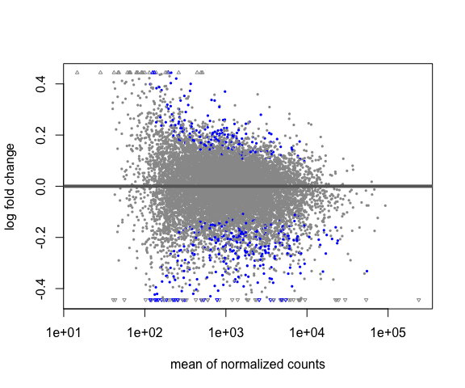<!-- -->

Note that `DESeq2` fails to give results for three genes (they have
extreme outliers). But they are not interesting genes (high pvalues in
other methods).

``` r
difmethods[apply(difmethods, 1, function(x) any(is.na(x))),]
```

    ##         lmlogcpm limmalogcpm limmatrend limmavoom limmavoomTMM  edgeRlrt
    ## Gh     0.9666708   0.9647778  0.9644649 0.4935548    0.5028742 0.2296831
    ## Inadl  0.1857345   0.1669024  0.1654348 0.1500759    0.1731358 0.1089681
    ## Prkcd  0.5978009   0.5798900  0.5764137 0.6066300    0.6558730 0.3448177
    ## Slc6a2 0.9912103   0.9907345  0.9907499 0.6532377    0.6663123 0.5736908
    ##        edgeRquasi deseq2
    ## Gh      0.9205048     NA
    ## Inadl   0.1157896     NA
    ## Prkcd   0.3491245     NA
    ## Slc6a2  0.9459939     NA

Also note that by default `DESeq2` applies Independent Filtering when
computing adjusted p-values. This is different than ‘standard’ FDR
correction, and tends to have greater power by ‘spending’ the type I
error according to the overall mean expression. However, it can also
lead to additional genes with missing adjusted p-values (these are
‘filtered’ out due to low overall expression). For more info, see [this
section of the DESeq2
vignette](https://bioconductor.org/packages/release/bioc/vignettes/DESeq2/inst/doc/DESeq2.html#independent-filtering-of-results).

# Heatmaps of top genes (limma-voom)

Just showing how this is done, using the analysis we just did. As an
illustration, we’ll use the limma-voom results, but we could sub in any
of the methods from the previous section. Note that we are displaying
top genes selected by p-value. This can easily be modified to separate
genes by up- and down-regulated or some other arrangement.

We’ll plot the log2(CPM+1) values, and order the columns by the factor
of interest first, and let the rows cluster.

``` r
#  make a copy of the data ordered by the factor of interest.
sumexpS <- sumexp[, order(colData(sumexp)$Sex, colData(sumexp)$Group, colData(sumexp)$DPC)]
sumexpD <- sumexp[, order(colData(sumexp)$DPC, colData(sumexp)$Group, colData(sumexp)$Sex)]
sumexpG <- sumexp[, order(colData(sumexp)$Group, colData(sumexp)$DPC, colData(sumexp)$Sex)]

pheatmap(assays(sumexpS)$log2cpm %>% data.frame() %>%
           dplyr::filter(rownames(sumexpS) %in% rownames(topTable(limmavoomTMM, number = 30, 
                                                     coef = "SexF", sort.by = "p"))),
         scale="row", color = bcols, border_color = NA,
         cluster_cols = FALSE,
         annotation_col = colData(sumexpS)[,c("Sex", "DPC", "Group")] %>% data.frame(), 
         main = "Top genes for Sex effect (limma-voom with TMM)")
```

<!-- -->

``` r
pheatmap(assays(sumexpG)$log2cpm %>% data.frame() %>%
           dplyr::filter(rownames(sumexpG) %in% rownames(topTable(limmavoomTMM, number = 30, 
                                                     coef = "GroupMu", sort.by = "p"))),
         scale="row", color = bcols, border_color = NA,
         cluster_cols = FALSE,
         annotation_col = colData(sumexpG)[,c("Group", "DPC", "Sex")] %>% data.frame(), 
         main = "Top genes for Group effect (limma-voom with TMM)")
```

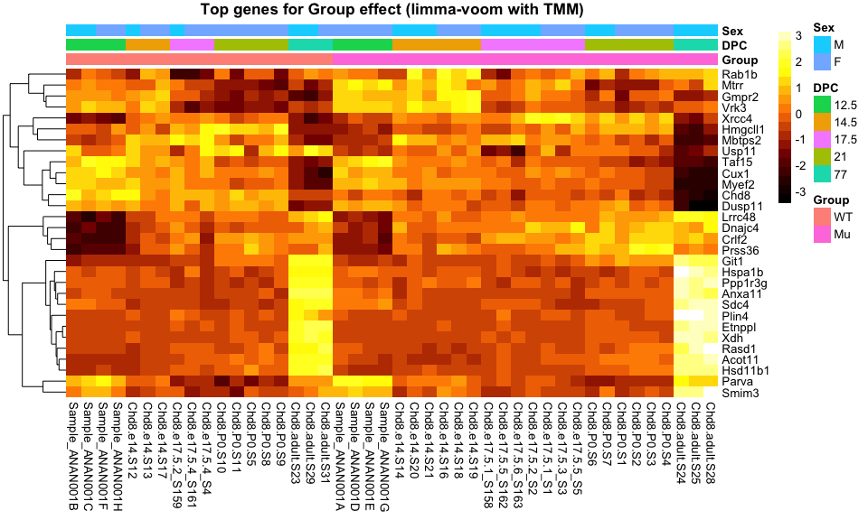<!-- -->

``` r
pheatmap(assays(sumexpD)$log2cpm %>% data.frame() %>%
           dplyr::filter(rownames(sumexpD) %in% rownames(topTable(limmavoomTMM, number = 30, 
                                                     coef = c("DPC14.5", "DPC17.5", "DPC21", "DPC77"),
                                                     sort.by = "F"))),
         scale="row", color = bcols, border_color = NA,
         cluster_cols = FALSE,
         annotation_col = colData(sumexpD)[,c("DPC", "Group", "Sex")] %>% data.frame(), 
         main = "Top genes for DPC effect (limma-voom with TMM)")
```

<!-- -->

We see the strongest visual effect with the DPC variable.

## Bonus topic: Heatmap with adjusted data (limma-trend)

Because the expression changes due to Group are small, to visualize them
better we can first adjust the data for DPC, as that’s a huge signal in
the data. It’s OK to do this as long as it’s clearly indicated that it
has been done. We’ll use the limma-trend version of the analysis since
this is carried out on the log2 CPM values, which are nice to use for
visualization (as opposed to raw counts).

The estimated (fitted) effect of DPC is the fitted coefficients for DPC
multiplied by the relevant part of the design matrix. We subtract that
from the original data to give us our “DPC-corrected” data.

``` r
dadj <- assays(sumexp)$log2cpm  - 
  coefficients(limmatrend)[,c("DPC14.5", "DPC17.5", "DPC21", "DPC77")] %*%
  t(modm[,c("DPC14.5", "DPC17.5", "DPC21", "DPC77")])
dadjG <- dadj[, order(colData(sumexp)$Group, colData(sumexp)$DPC, colData(sumexp)$Sex)]

# Makes it a lot easier to see the Chd8-driven pattern:
pheatmap(dadjG %>% data.frame() %>%
           dplyr::filter(rownames(sumexpG) %in% rownames(topTable(limmavoomTMM, number = 30, 
                                                     coef = "GroupMu", sort.by = "p"))),
         scale="row", 
         cluster_rows = TRUE, cluster_cols = FALSE, color = bcols, border_color = NA,
           annotation_col = colData(sumexpG)[,c("Group", "DPC","Sex" )] %>% data.frame(),
         main = "Chd8 genotype effect, Dev stage-corrected (limma-trend)")
```

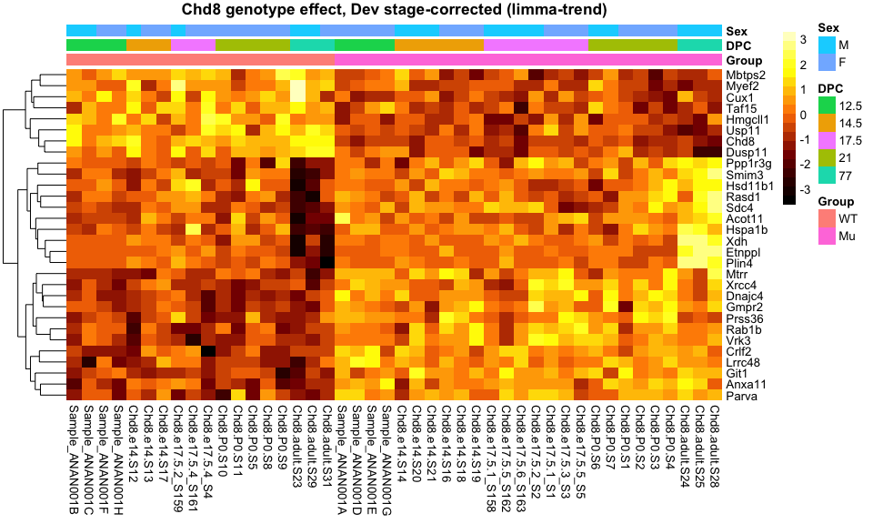<!-- -->

Now the pattern by Group (WT vs Mutant) is a bit easier to see.

Heatmap for all the FDR \< 0.05 genes (there are 305 by limma-trend:

``` r
pheatmap(dadjG %>% data.frame() %>%
           dplyr::filter(rownames(sumexpG) %in% rownames(topTable(limmavoomTMM, number = Inf, 
                                                                  p.value = 0.05,
                                                                  coef = "GroupMu", 
                                                                  sort.by = "p"))),
         scale="row", show_rownames = FALSE,
         cluster_rows = TRUE, cluster_cols = FALSE, color = bcols, border_color = NA,
           annotation_col = colData(sumexpG)[,c("Group", "DPC","Sex" )] %>% data.frame(),
         main = "Chd8 genotype FDR < 0.05, Dev stage-corrected, clipped (limma-trend)")
```

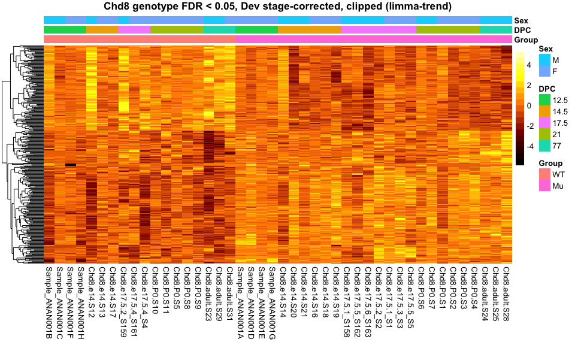<!-- -->

# Comparing methods

Now that we’ve run 8 different approaches to test each gene for
differences in expression by Group (Chd8 mutant vs WT), let’s finally
compare the results!

Do all methods find the Chd8 gene as significant (FDR \< 0.05, with FDR
estimated by q-value)?

``` r
# compute qvals
difqval <- apply(difmethods, 2, function(x) qvalue(x)$qvalue)

difqval["Chd8",]
```

    ##     lmlogcpm  limmalogcpm   limmatrend    limmavoom limmavoomTMM     edgeRlrt 
    ## 3.393778e-09 9.788399e-10 4.241634e-10 4.145929e-10 1.816495e-10 1.317549e-24 
    ##   edgeRquasi       deseq2 
    ## 1.572575e-10 2.484827e-25

Yes! Though the p-values for DESeq2 and edgeR-LRT are much smaller than
the rest.

Now, let’s examine the overall p-value distributions for each approach
to make sure they all look well-behaved.

``` r
difmethods %>%
  pivot_longer(names_to = "Method", values_to = "p-value", cols = everything()) %>%
  ggplot(aes(x = `p-value`, group = Method)) +
  geom_histogram(bins = 50) +
  facet_wrap(~ Method)
```

    ## Warning: Removed 4 rows containing non-finite values (`stat_bin()`).

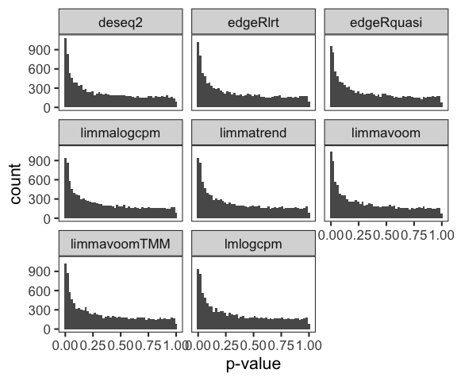<!-- -->

They all look reasonable; no obvious cause for concern.

Next, here’s a plot of pair-wise comparisons of p-values (-log10). To
avoid warnings, we remove genes that have missing values.

``` r
-log10(difmethods) %>% 
  drop_na() %>%
  ggpairs(lower = list(continuous = wrap("points", alpha = 0.2, size = 0.1)))
```

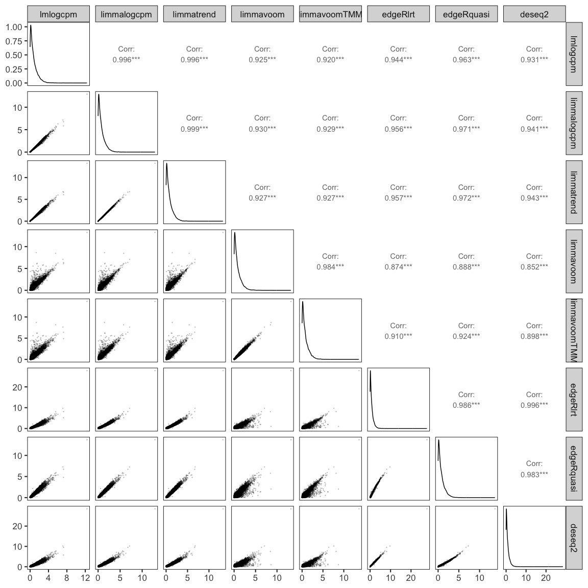<!-- --> We
can see that some methods have extremely high (Pearson) correlation
(e.g. lm on logCPM and limma on logCPM), and others a bit lower
(e.g. limma-voom and DESeq2).

Here we make a heatmap of Spearman correlations among methods.
Clustering of rows and columns as want to see what’s similar to what.

``` r
mcor <- cor(difmethods, method="spear", use="pair")
pheatmap(mcor, color = bcols)
```

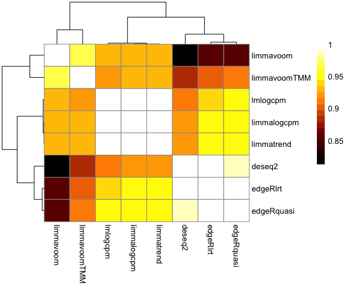<!-- -->

Interestingly, it seems there are three main groupings: (1) limma-voom
approaches, (2) the other limma approaches (original and trend) along
with regular lm, and (3) DESeq2 and edgeR approaches.

Let’s examine the agreement of the top genes (FDR \< 0.05), with FDR
estimated by q-value.

``` r
# get genes qval < 0.05
topGenes <- apply(difqval, 2, function(x) row.names(difqval[x < 0.05,]))

# Counts for each method
unlist(lapply(topGenes, length))
```

    ##     lmlogcpm  limmalogcpm   limmatrend    limmavoom limmavoomTMM     edgeRlrt 
    ##          420          385          387          626          583          552 
    ##   edgeRquasi       deseq2 
    ##          403          717

``` r
# Upset plot
upset(fromList(topGenes), nsets = 8, order.by = "freq")
```

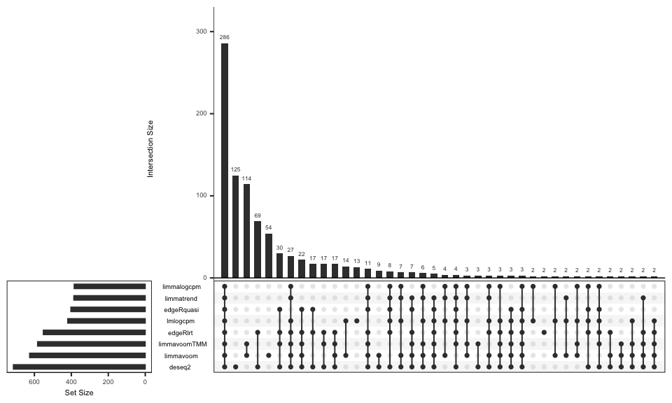<!-- -->

We see that `DESeq2` finds the highest number of significant genes, and
`limma` on logCPM values finds the fewest. There is a large set of genes
that all methods call significant.

There are plenty of other ways we could evaluate the similarities and
differences of the results, or drill into details, but this is good
enough to give a sense.

General observations:

- Overall agreement among methods is quite good, especially for the top
  genes.
- Most significant p-values from edgeR (LR) and DESeq2 are much smaller
  than for other methods (not that you should seriously believe p-values
  like 10^-30).
- limma-trend didn’t perform much differently than regular limma,
  possibly because of the wide range of depths among samples (greater
  than 4-fold difference).
- Variations of approach within methods doesn’t make a massive
  difference (e.g. voom with or without norm factors)

## Differences between limma-trend and limma-voom

While things look very similar overall, we should be curious about the
genes that the methods disagree about. Let’s examine the gene ranks
between limma-trend and limma-voom.

``` r
# This is a zoom in on just two methods.
plot(rank(difmethods[,"limmatrend"]), rank(difmethods[,"limmavoom"]), pch=20, cex=0.4,)
```

<!-- -->

We’ll isolate genes which rank high in limma-voom but low in
limma-trend: ranked in top 10 of limma-voom, but not in top 1000 of
limma-trend.

``` r
difranks <- apply(difmethods, 2, rank)

disg <- row.names(difmethods)[which( difranks[,"limmavoom"] < 10 & 
                                     difranks[,"limmatrend"] > 1000)]

# these "hits" are specific to voom.
difmethods[disg,]
```

    ##          lmlogcpm limmalogcpm limmatrend    limmavoom limmavoomTMM    edgeRlrt
    ## Etnppl 0.03392980  0.03255416 0.06004649 8.773553e-07 6.359142e-07 0.009509664
    ## Plin4  0.04550473  0.03545877 0.03687705 2.443131e-09 1.935009e-09 0.099879185
    ## Xdh    0.02960385  0.02621567 0.04298137 6.314318e-07 6.585187e-07 0.012479232
    ##         edgeRquasi     deseq2
    ## Etnppl 0.046673481 0.12000347
    ## Plin4  0.009594486 0.09961678
    ## Xdh    0.039117814 0.04866324

``` r
difranks[disg,]
```

    ##        lmlogcpm limmalogcpm limmatrend limmavoom limmavoomTMM edgeRlrt
    ## Etnppl     1916        1856       2597         9            6      973
    ## Plin4      2235        1945       2010         2            2     3391
    ## Xdh        1757        1654       2172         7            7     1157
    ##        edgeRquasi deseq2
    ## Etnppl       2259   3816
    ## Plin4         914   3461
    ## Xdh          2053   2390

What do these genes look like?

``` r
# get counts in tidy format
counts_long <- assays(sumexp)$counts %>% data.frame() %>%
  rownames_to_column("Gene") %>%
  pivot_longer(names_to = "Sample", values_to = "Count", cols = -Gene) %>%
  left_join(data.frame(colData(sumexp)), by="Sample")

counts_long %>% 
  filter(Gene %in% disg) %>%
  ggplot(aes(x = Group, y = Count, colour = Group)) +
  geom_jitter(width=0.05, height=0, size=3 )  + 
  facet_grid(Gene ~ DPC) + 
  ggtitle("limma-voom only genes (counts)") + 
  labs(x="Group" ) + 
  geom_hline(yintercept = log2(1), color="grey")
```

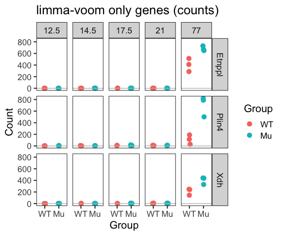<!-- -->

*Conclusions:* Each of these three genes being among the top hits for
limma-voom looks fishy. Except for adults, they are is barely expressed
(0-4 raw counts vs \~500). Maybe we’d like to see this gene come up if
we were looking for interaction effects.

Why does this happen? For voom the weighting means that very low
expression values are going to have little effect on the model fit.
Inspecting the weights (`vw[disg,]$weights`) they are about 30-40x
higher for the adults.

Whether you think Etnppl, Plin4, and Xdh are false positives or not
could be a matter of opinion (we don’t know the ground truth), but one
lesson is: before getting excited about any particular result, look at
the data!
